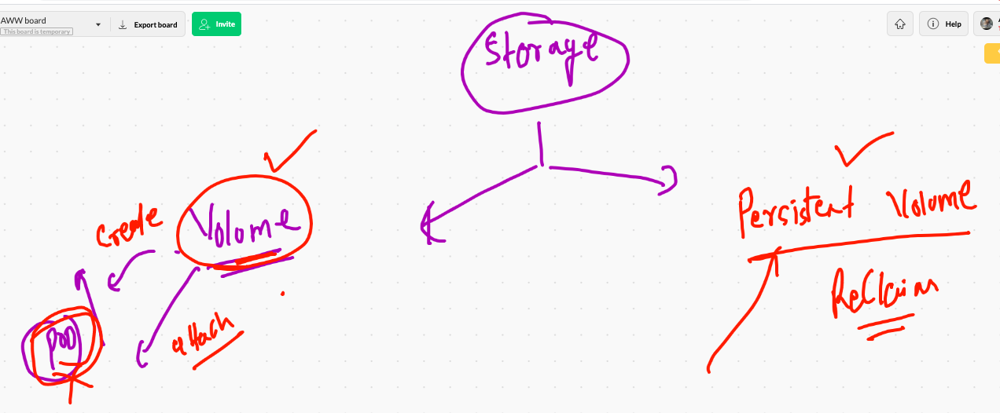

# FInaly 

# COntainer based tech

['podman'] ('https://podman.io/')

## app deployment in k8s 


## Deploy mysql DB in K8s 


### 

```
kubectl  create  deployment  ashudb  --image=mysql -n ashu-space  --dry-run=client -o yaml >ashudb.yml

```
## Env in yaml file in K8s

```
❯ cat  ashudb.yml
apiVersion: apps/v1
kind: Deployment
metadata:
  creationTimestamp: null
  labels:
    app: ashudb
  name: ashudb  # name of deployment 
  namespace: ashu-space  # name of namespace 
spec:
  replicas: 1
  selector:
    matchLabels:
      app: ashudb
  strategy: {}
  template:
    metadata:
      creationTimestamp: null
      labels:
        app: ashudb   # label of pod
    spec:
      containers:
      - image: mysql   # image from docker hub 
        name: mysql  # name of container 
        ports:
        - containerPort: 3306  # default port 
        env:  #  to define/replace env variable
        - name: MYSQL_ROOT_PASSWORD
          valueFrom:
           secretKeyRef:  # to use secret it is a keyword 
            name: ashudbinfo # name of secret 
            key: sqlpw  # key we assigned during secret creation 

        resources: {}

```
## Secret as New k8s api Resources 

### creating secret to store db password

```
❯ kubectl  create  secret   generic  ashudbinfo  --from-literal  sqlpw=oracle123  -n ashu-space
secret/ashudbinfo created
```
##

```
❯ kubectl  describe  secret  ashudbinfo  -n ashu-space
Name:         ashudbinfo
Namespace:    ashu-space
Labels:       <none>
Annotations:  <none>

Type:  Opaque

Data
====
sqlpw:  9 bytes

```


## checking base64 based encoded information in secret

```
 kubectl get secret ashudbinfo  -o yaml  -n ashu-space
apiVersion: v1
data:
  sqlpw: b3JhY2xlMTIz
kind: Secret

```

## deployment of DB 

```
2134  kubectl apply -f ashudb.yml
 2135  kubectl get  deploy -n ashu-space
 2136  kubectl get  po  -n ashu-space
 2137  kubectl logs  ashudb-685f8b99c8-4mcmr   -n ashu-space
 
 ```
 
 ## checking password 
 
 ```
 ❯ kubectl get  po -n ashu-space
NAME                      READY   STATUS    RESTARTS   AGE
ashudb-685f8b99c8-4mcmr   1/1     Running   0          4m56s
❯ kubectl  exec -it ashudb-685f8b99c8-4mcmr  -n ashu-space  -- bash
root@ashudb-685f8b99c8-4mcmr:/# 
root@ashudb-685f8b99c8-4mcmr:/# 
root@ashudb-685f8b99c8-4mcmr:/# 
root@ashudb-685f8b99c8-4mcmr:/# 
root@ashudb-685f8b99c8-4mcmr:/# 
root@ashudb-685f8b99c8-4mcmr:/# mysql -u root -p
Enter password: 
Welcome to the MySQL monitor.  Commands end with ; or \g.
Your MySQL connection id is 8
Server version: 8.0.22 MySQL Community Server - GPL

Copyright (c) 2000, 2020, Oracle and/or its affiliates. All rights reserved.

Oracle is a registered trademark of Oracle Corporation and/or its
affiliates. Other names may be trademarks of their respective
owners.

Type 'help;' or '\h' for help. Type '\c' to clear the current input statement.

mysql> 

```
# Storage in k8s


## storage use type 



## mysql Db deployment with secret and NFS volume 

```
❯ cat ashudb.yml
apiVersion: apps/v1
kind: Deployment
metadata:
  creationTimestamp: null
  labels:
    app: ashudb
  name: ashudb  # name of deployment 
  namespace: ashu-space  # name of namespace 
spec:
  replicas: 1
  selector:
    matchLabels:
      app: ashudb
  strategy: {}
  template:
    metadata:
      creationTimestamp: null
      labels:
        app: ashudb   # label of pod
    spec:
      volumes:  # creating volume 
      - name: ashudbvol # name of volume 
        nfs:   #  type of volume from where you need storage
         server: 172.31.75.167  # nfs server IP 
         path: /storage/ashu   # storge path from NFS server 
      containers:
      - image: mysql   # image from docker hub 
        name: mysql  # name of container 
        volumeMounts:
        - name: ashudbvol
          mountPath: /var/lib/mysql 
        ports:
        - containerPort: 3306  # default port 
        env:  #  to define/replace env variable
        - name: MYSQL_ROOT_PASSWORD
          valueFrom:
           secretKeyRef:  # to use secret it is a keyword 
            name: ashudbinfo # name of secret 
            key: sqlpw  # key we assigned during secret creation 

        resources: {}


```

## two tier application design 

## wordpress in k8s 


## deploying of db service 

```
❯ kubectl  get deploy -n ashu-space
NAME     READY   UP-TO-DATE   AVAILABLE   AGE
ashudb   1/1     1            1           44m
❯ kubectl  expose deployment  ashudb  --type ClusterIP --port 1122 --target-port 3306 --name ashudbsvc -n ashu-space
service/ashudbsvc exposed
❯ kubectl get svc -n ashu-space
NAME        TYPE        CLUSTER-IP     EXTERNAL-IP   PORT(S)    AGE
ashudbsvc   ClusterIP   10.97.122.10   <none>        1122/TCP   10s

```

## wordpress frontend deployment 

```
❯ kubectl create deployment ashuwordpress --image=wordpress:4.8-apache  -n ashu-space --dry-run=client -o yaml >wordpress.yaml

====
❯ cat  wordpress.yaml
apiVersion: apps/v1
kind: Deployment
metadata:
  creationTimestamp: null
  labels:
    app: ashuwordpress
  name: ashuwordpress
  namespace: ashu-space
spec:
  replicas: 1
  selector:
    matchLabels:
      app: ashuwordpress
  strategy: {}
  template:
    metadata:
      creationTimestamp: null
      labels:
        app: ashuwordpress
    spec:
      containers:
      - image: wordpress:4.8-apache
        name: wordpress
        env:
        - name: WORDPRESS_DB_HOST  # env variable for connecting DB from wordpress 
          value: ashudbsvc  # svc name of DB 
        - name: WORDPRESS_DB_PASSWORD # db root password of  mysql pod 
          valueFrom:
           secretKeyRef:
            name: ashudbinfo # name of secret 
            key: sqlpw  # key of secret 
        resources: {}
status: {}

====

❯ kubectl apply -f wordpress.yaml
deployment.apps/ashuwordpress created
❯ kubectl  get po -n ashu-space
NAME                           READY   STATUS    RESTARTS   AGE
ashudb-dd4d94d4f-5nkql         1/1     Running   0          58m
ashuwordpress-bb946877-nr56m   1/1     Running   0          9s

░▒▓ ~/Desktop/ashuk8sres ········································· kubernetes-admin@kubernetes ⎈  12:14:07 PM ▓▒░─╮
❯ kubectl  logs ashuwordpress-bb946877-nr56m  -n ashu-space                                                         ─╯


```


## exposing deployment to svc


```
❯ kubectl expose deploy ashuwordpress  --type NodePort --port 1122 --target-port 80 --name wpsvc -n ashu-space
service/wpsvc exposed
❯ kubectl get svc -n ashu-space
NAME        TYPE        CLUSTER-IP     EXTERNAL-IP   PORT(S)          AGE
ashudbsvc   ClusterIP   10.97.122.10   <none>        1100/TCP         16m
wpsvc       NodePort    10.110.5.105   <none>        1122:30483/TCP   10s


```

## wordpress deployment commands

```
169  kubectl apply -f wordpress.yaml 
 2170  kubectl  get po -n ashu-space 
 2171  kubectl  logs ashuwordpress-bb946877-nr56m  -n ashu-space 
 2172  kubectl exec -it ashuwordpress-bb946877-nr56m  -n ashu-space -- bash 
 2173  history
 2174  kubectl get deploy -n ashu-space 
 2175  kubectl expose deploy ashuwordpress  --type NodePort --port 1122 --target-port 80 --name wpsvc -n ashu-space
 2176  kubectl get svc -n ashu-space 
 2177  kubectl get deploy -n ashu-space 
 2178  history
 2179  ls
 2180  vim wordpress.yaml
 2181  kubectl explain pod.spec.containers  |   grep -i imagepull
 2182  vim wordpress.yaml
 2183  kubectl explain pod.spec.containers  |   less
 2184  vim wordpress.yaml
 2185  kubectl get po -n ashu-space 
 2186  kubectl exec -it ashuwordpress-bb946877-nr56m  -n ashu-space -- bash 
 2187  ls
 2188  kubectl delete all --all -n ashu-space 
 2189  ls
 2190  vim  ashudb.yml
 2191  kubectl apply -f ashudb.yml 
 2192  kubectl get deploy -n ashu-space 
 2193  kubectl get po  -n ashu-space 
 2194  kubectl describe  po  -n ashu-space 
 2195  kubectl get no
 2196  kubectl replace -f ashudb.yml --force 
 2197  kubectl get po -n ashu-space 
 2198  kubectl describe  po -n ashu-space 
 2199  kubectl get po -n ashu-space 
 2200  ls
 2201  kubectl get  po -n ashu-space 
 2202  kubectl expose deploy ashudb --type ClusterIP --port 3306  --name ashudbsvc -n ashu-space 
 2203  kubectl get svc -n ashu-space
 2204  cat  wordpress.yaml
 2205  kubectl get po -n ashu-space 
 2206  cat  ashudb.yml
 2207  kubectl replace -f ashudb.yml --force 
 2208  kubectl get  po -n ashu-space 
 2209  kubectl  get  svc -n ashu-space 
 2210  kubectl get  po -n ashu-space --show-labels
 2211  kubectl  get  svc -n ashu-space -o yaml
 2212  history
 2213  kubectl apply -f wordpress.yaml 
 2214  kubectl get po -n ashu-space 
 2215  kubectl get po -n ashu-space  -w
 2216  ls
 2217  vim wordpress.yaml
 2218  kubectl get deploy -n ashu-space 
 2219  kubectl expose deploy ashuwordpress  --type NodePort --port 80 --target-port 80 -n ashu-space 
 2220  kubectl get svc -n ashu-space 
 2221  kubectl  get po -n ashu-space 
 2222  kubectl exec -it ashudb-787bd8f6f4-r5dbk  -n ashu-space -- bash 
 2223  kubectl  get po -n ashu-space 
 2224  kubectl exec -it ashuwordpress-bb946877-7kncw   -n ashu-space -- bash 
 2225  kubectl logs ashudb-787bd8f6f4-r5dbk -n ashu-space 
 2226  kubectl get svc -n ashu-space 
 
 ```
 
