# Container recap

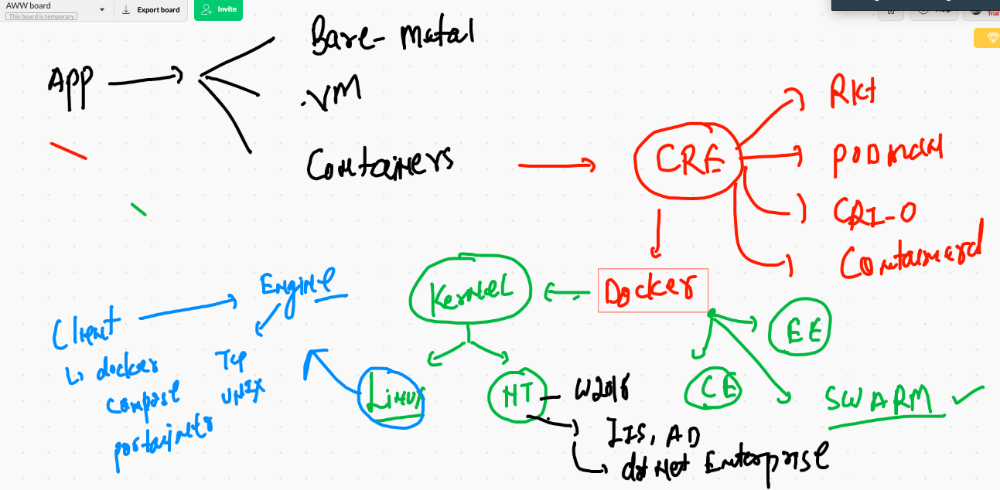

## compose with apache tomcat 

```
version: "3.8"
services:
 javaapp:
  image: ashutomcat:v0011
  build: .
  container_name: ashutomc1
  restart: always
  networks:
   - ashubr11  # using custom network 
  ports:
   - "7700:8080"  # similar to docker -p 7700:8080 
     
networks:
 ashubr11:  # creating custom network 
 
 ```
 
 ## docker compsoe history 
 
 ```
  744  docker-compose -f ashutoshh.yaml down
 
  746  docker-compose -f ashutoshh.yaml  up --build  -d
  747  history 
  748  docker-compose -f ashutoshh.yaml  ps
  ```
  
  # Container based app problems 
  
  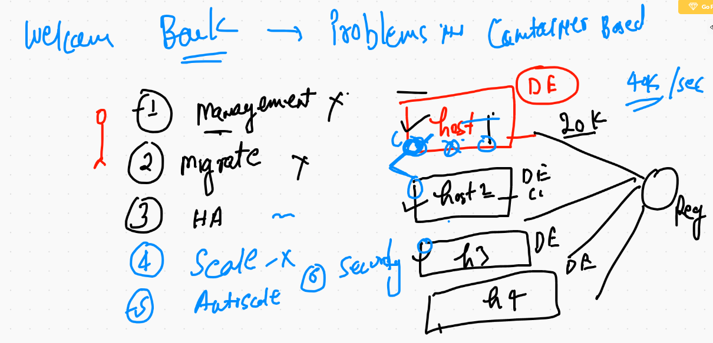
  
  ## container orchestration 
  
  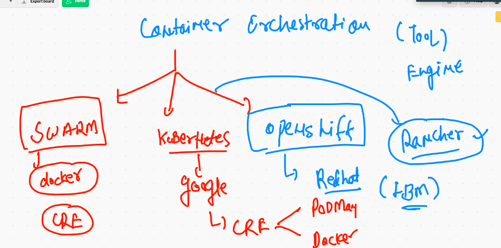
  
  ## k8s history 
  
  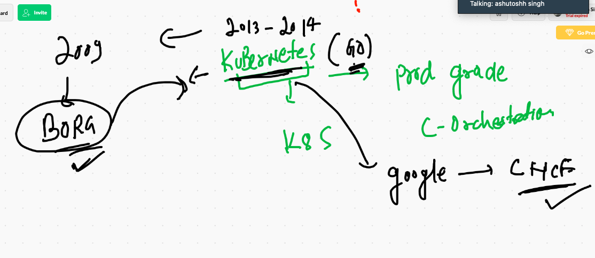
  
  ## k8s arch level 1
  
  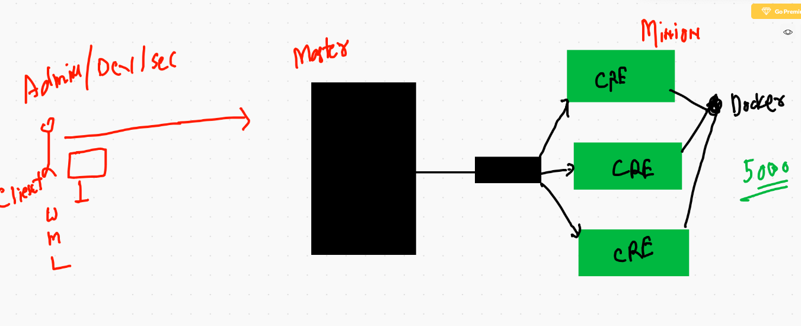


## k8s arch kube apiserver 

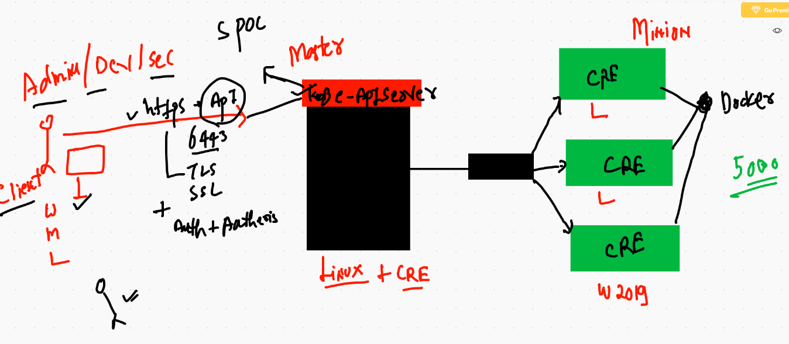

## k8s arch kube-schedular

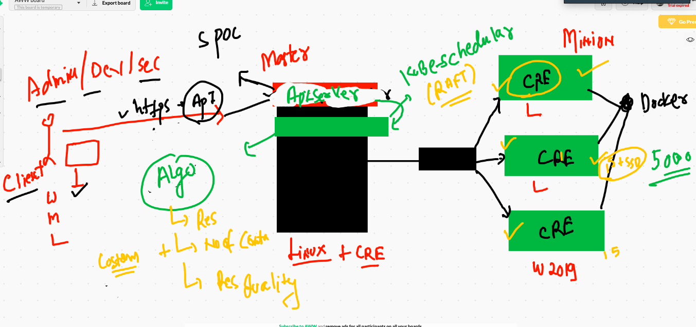

## k8s node and replication controller

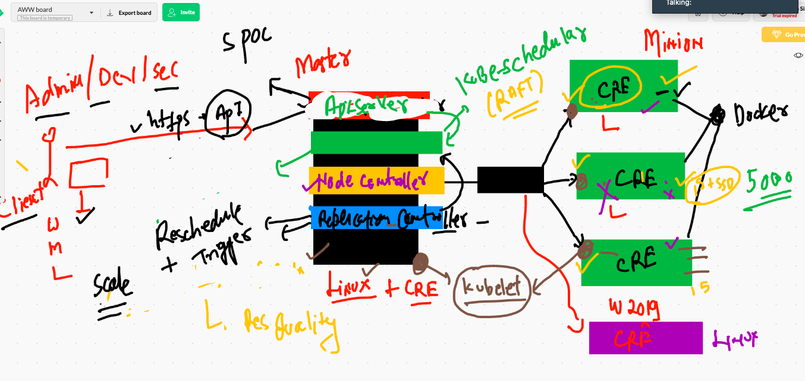

## k8s etcd 

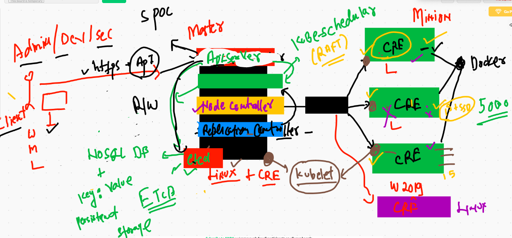

## k8s minion network CNI & kube proxy

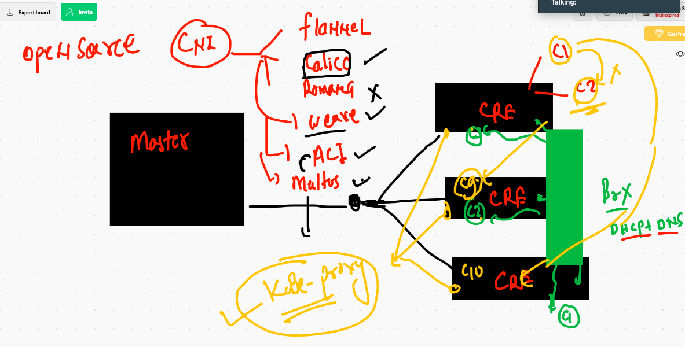

# Install k8s single node cluster using MinikUbe 

## Minikube download

[Minikube link] ('https://minikube.sigs.k8s.io/docs/start/')


## installing on Mac BigSUr OS

```
❯ curl -LO https://storage.googleapis.com/minikube/releases/latest/minikube-darwin-amd64
  % Total    % Received % Xferd  Average Speed   Time    Time     Time  Current
                                 Dload  Upload   Total   Spent    Left  Speed
100 53.1M  100 53.1M    0     0  6007k      0  0:00:09  0:00:09 --:--:-- 6445k
❯ ls -lh minikube-darwin-amd64
-rw-r--r--  1 fire  staff    53M Dec  2 14:29 minikube-darwin-amd64
❯ sudo install minikube-darwin-amd64 /usr/local/bin/minikube
Password:
❯ minikube version
minikube version: v1.15.1
commit: 23f40a012abb52eff365ff99a709501a61ac5876


```

## configure 

```
❯ minikube  start
😄  minikube v1.15.1 on Darwin 11.0.1
✨  Automatically selected the hyperkit driver
💿  Downloading VM boot image ...
    > minikube-v1.15.0.iso.sha256: 65 B / 65 B [-------------] 100.00% ? p/s 0s
    > minikube-v1.15.0.iso: 181.00 MiB / 181.00 MiB [] 100.00% 6.22 MiB p/s 30s
👍  Starting control plane node minikube in cluster minikube
💾  Downloading Kubernetes v1.19.4 preload ...
    > preloaded-images-k8s-v6-v1.19.4-docker-overlay2-amd64.tar.lz4: 486.35 MiB
🔥  Creating hyperkit VM (CPUs=2, Memory=2200MB, Disk=20000MB) ...
🐳  Preparing Kubernetes v1.19.4 on Docker 19.03.13 ...
🔎  Verifying Kubernetes components...
🌟  Enabled addons: storage-provisioner, default-storageclass
🏄  Done! kubectl is now configured to use "minikube" cluster and "default" namespace by default


```

## checking k8s single node cluster by minikube 

```
❯ minikube status
minikube
type: Control Plane
host: Running
kubelet: Running
apiserver: Running
kubeconfig: Configured


```
## minikube history 

```
 1719  curl -LO https://storage.googleapis.com/minikube/releases/latest/minikube-darwin-amd64
 1720  ls -lh minikube-darwin-amd64
 1721  sudo install minikube-darwin-amd64 /usr/local/bin/minikube
 1722  minikube version 
 1723  minikube delete 
 1724  minikube  start 
 1725  minikube  status
 1726  minikube  delete
 1727  minikube  status
 1728  minikube  start  --driver=docker 
 1729  docker images
 1730  docker ps
 1731  minikube status 
 1732  minikube stop
 1733  minikube status 
 1734  minikube start
 1735  minikube status 
 1736  minikube ssh
 1737  minikube ip 
 
 ```
 
 ## k8s cluster installation methods
 
 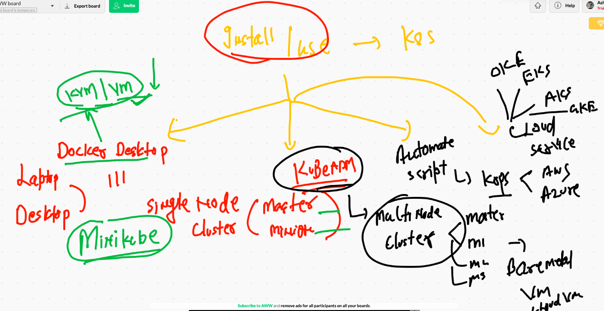
 
 
 ## Setting up k8s multinode cluster using kubeadm 
 
 ### use dns + dhcp based vm / baremetal 
 
 ### disable swap memory in linux 
 ### enable iptables kernel driver for container network purpose 
 
 ## Run this in all the nodes
 
 ```
 [root@master-node ~]# cat setup.sh 
swapoff -a # disable swap memory 
modprobe br_netfilter
echo '1' > /proc/sys/net/bridge/bridge-nf-call-iptables

# adding yum repo to install docker & kubeadm 

cat  <<EOF  >/etc/yum.repos.d/kube.repo
[kube]
baseurl=https://packages.cloud.google.com/yum/repos/kubernetes-el7-x86_64
gpgcheck=0
EOF


## install docker & kubeadm 

yum  install docker kubeadm -y

## startin docker and kubelet 

systemctl enable --now docker kubelet 

```

## starting and setting up all the components on Master Node :- Setting up control plane 

### only on Master node

```
kubeadm  init   --pod-network-cidr=192.168.0.0/16  --apiserver-advertise-address=0.0.0.0 --apiserver-cert-extra-sans=54.166.21.186 


```

## on master node all the certificates and configuration files are copied here

```
[root@master-node ~]# cd  /etc/kubernetes/
[root@master-node kubernetes]# ls
admin.conf  controller-manager.conf  kubelet.conf  manifests  pki  scheduler.conf
[root@master-node kubernetes]# ls pki/
apiserver-etcd-client.crt     apiserver-kubelet-client.key  ca.crt  front-proxy-ca.crt      front-proxy-client.key
apiserver-etcd-client.key     apiserver.crt                 ca.key  front-proxy-ca.key      sa.key
apiserver-kubelet-client.crt  apiserver.key           

```

## On master node you need to apply CNI 

```
 33  wget https://docs.projectcalico.org/manifests/calico.yaml
   34  ls
   35  cat  calico.yaml 
   36  ls
   37  kubectl apply -f calico.yaml 
   
   ```
   ### checking now
   
   ```
   [root@master-node ~]# kubectl  get  nodes
NAME            STATUS   ROLES    AGE     VERSION
master-node     Ready    master   9m46s   v1.19.4
minion-node-1   Ready    <none>   7m9s    v1.19.4
minion-node-2   Ready    <none>   7m3s    v1.19.4
minion-node-3   Ready    <none>   6m56s   v1.19.4

```


# Time of k8s client side installation 

[kubeclt link] ('https://kubernetes.io/docs/tasks/tools/install-kubectl/')

## Installing kubectl on mac os

```
curl -LO "https://storage.googleapis.com/kubernetes-release/release/$(curl -s https://storage.googleapis.com/kubernetes-release/release/stable.txt)/bin/darwin/amd64/kubectl"
  % Total    % Received % Xferd  Average Speed   Time    Time     Time  Current
                                 Dload  Upload   Total   Spent    Left  Speed
100 47.1M  100 47.1M    0     0  5958k      0  0:00:08  0:00:08 --:--:-- 6411k
❯ ls
Applications           Downloads              PacketTracer7.3.1.0362 admin.conf             macos-terminal-themes
Creative Cloud Files   Library                Pictures               awscli-bundle          minikube-darwin-amd64
Desktop                Movies                 Public                 go                     powerlevel10k
Documents              Music                  VirtualBox VMs         kubectl   


----

❯ chmod +x ./kubectl
❯ sudo mv ./kubectl /usr/local/bin/kubectl
Password:
Sorry, try again.
Password:
❯ kubectl version --client
Client Version: version.Info{Major:"1", Minor:"19", GitVersion:"v1.19.4", GitCommit:"d360454c9bcd1634cf4cc52d1867af5491dc9c5f", GitTreeState:"clean", BuildDate:"2020-11-11T13:17:17Z", GoVersion:"go1.15.2", Compiler:"gc", Platform:"darwin/amd64"}

```


## Kubectl to connect remote k8s cluster 

```
kubectl  get  nodes  --kubeconfig  admin.conf
NAME            STATUS   ROLES    AGE   VERSION
master-node     Ready    master   30m   v1.19.4
minion-node-1   Ready    <none>   28m   v1.19.4
minion-node-2   Ready    <none>   27m   v1.19.4
minion-node-3   Ready    <none>   27m   v1.19.4

```

## more commands 

```
❯ kubectl  version  --kubeconfig  admin.conf
Client Version: version.Info{Major:"1", Minor:"19", GitVersion:"v1.19.4", GitCommit:"d360454c9bcd1634cf4cc52d1867af5491dc9c5f", GitTreeState:"clean", BuildDate:"2020-11-11T13:17:17Z", GoVersion:"go1.15.2", Compiler:"gc", Platform:"darwin/amd64"}
Server Version: version.Info{Major:"1", Minor:"19", GitVersion:"v1.19.4", GitCommit:"d360454c9bcd1634cf4cc52d1867af5491dc9c5f", GitTreeState:"clean", BuildDate:"2020-11-11T13:09:17Z", GoVersion:"go1.15.2", Compiler:"gc", Platform:"linux/amd64"}
❯ kubectl  cluster-info   --kubeconfig  admin.conf
Kubernetes master is running at https://54.166.21.186:6443
KubeDNS is running at https://54.166.21.186:6443/api/v1/namespaces/kube-system/services/kube-dns:dns/proxy

To further debug and diagnose cluster problems, use 'kubectl cluster-info dump'.

```


## k8s client and cluster 

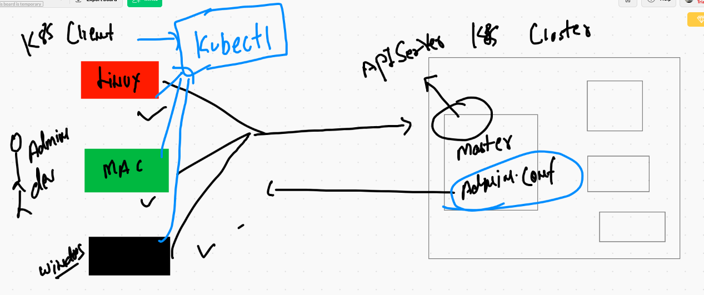

