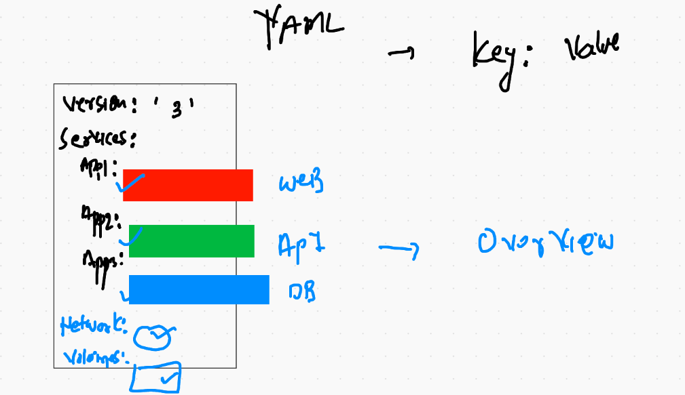

# containers with Docker using community edition 

## day2 agenda


## containers clean up

```
[ec2-user@ip-172-31-75-167 ~]$ docker kill $(docker ps -q)
9860b9d7029f
f0eebb53cc27
5dc9f5eb7929
[ec2-user@ip-172-31-75-167 ~]$ docker rm  $(docker ps -aq)
3a3a5bb94ee8
9860b9d7029f
f0eebb53cc27
5dc9f5eb7929
89f79716e587
[ec2-user@ip-172-31-75-167 ~]$ docker  ps -a
CONTAINER ID        IMAGE               COMMAND 

```

## docker image clean up

```
[ec2-user@ip-172-31-75-167 ~]$ docker rmi  $(docker images -q)  -f
Untagged: nav:pythonapp1
Untagged: navneeth:apacheapp1
Deleted: sha256:b231bfef585a46168da02f10d02bbb0d082dbd647928dd181249c19ba97ecae5
Deleted: sha256:38df2acccc12f10e84dc3c4bbc1cde6a000d12361b2e52da9e8b93708226c12c
Deleted: sha256:4f367b8c90539d78fc589e101926fadadd66a202362fc4f5a14eb70bcbae1ddb
Deleted: sha256:d5cbe189dea4cdfced3459ca225f5178838a53749eaa18e01ce5fad40f2ed0b7
Deleted: sha256:d1de8707e29b00dc441247d8add6555e1bee3e5910cabb1ad887292357b056c6
Deleted: sha256:9d7cbe4867049491ca7a8dabbe37a597468cc3c9589c02a7df6469269c015aab
Deleted: sha256:c0872342c309b411596a982f8b4af2b968f5916f7fbadfd815ebfccbb5b8b2eb
Untagged: python:latest
Untagged: python@sha256:b6a9702c4b2f9ceeff807557a63a710ad49ce737ed85c46174a059a299b580f2
Deleted: sha256:a3fe352c53772546456396ede7a671fea7db15d8524ec91daa8b690adcf58fd1
Deleted: sha256:306bae6804888f5d81d5bb578eb245e72d906302eac0344055386afc2169f64d
Deleted: sha256:15bddf90695cd199ea8ffcd9517e8b2014f543fe5591ff56317491220638f105
Deleted: sha256:5e4792624d507a51e983591a1ddbeb988b00ea47b59ec0c266ff6ceb1e045ab3
Deleted: sha256:16e296291ea9808510c2c2ffded1766fdac23521f45917ac59421b979fd549fc
Deleted: sha256:fb78f5d256e23a25466b4bbeac715815978498e6a4dcf901f622bae575c4c01f
Deleted: sha256:be048ca7e7af3c225efaf44d9bf81c2d274d0860e563cd97e5f2630c958f24cd
Deleted: sha256:e93ebf51004cfe34370a8930dc7016c067a8c5cd4754b932dedca1739f0c6e29
Deleted: sha256:86569a54d5d4735f27748c0e5d9ead04f48d36bbaaeaa755a1e022a6eb32d650
Deleted: sha256:114ca5b7280f3b49e94a67659890aadde83d58a8bde0d9020b2bc8c902c3b9de
Error: No such image: b231bfef585a
[ec2-user@ip-172-31-75-167 ~]$ docker images
REPOSITORY          TAG                 IMAGE ID            CREATED             SIZE
[ec2-user@ip-172-31-75-167 ~]$ docker ps -a
CONTAINER ID        IMAGE               COMMAND     

```

## Python flask based app 

```
 docker  build  -t  ashuflaskapp:v001  -f  ashu_flask.dockerfile .
 
```

### creating containers 

```
docker run --name ashuc1 -d -p 1100:5000 ashuflaskapp:v001 
```

# Docker image sharing 


## saving docker image as tar

```
[ec2-user@ip-172-31-75-167 ~]$ docker save  -o  ashuflask.tar  930c0e4f3e2a
[ec2-user@ip-172-31-75-167 ~]$ ls
ashuflask.tar  day1  day2
[ec2-user@ip-172-31-75-167 ~]$ ls  -lh ashuflask.tar 
-rw------- 1 ec2-user ec2-user 879M Dec  1 05:11 ashuflask.tar

```

## restoring docker image using tar file 

```
[ec2-user@ip-172-31-75-167 ~]$ docker images  |  grep -i ashu

[ec2-user@ip-172-31-75-167 ~]$ docker load -i ashuflask.tar 
4b563e087903: Loading layer [==================================================>]  6.144kB/6.144kB
Loaded image ID: sha256:930c0e4f3e2ae2c68a91ab31b70f7e11a92af78ec7403bb78911cf514c258124
[ec2-user@ip-172-31-75-167 ~]$ docker images  |  grep -i ashu
[ec2-user@ip-172-31-75-167 ~]$ docker images  |  grep -i 930
<none>                  <none>              930c0e4f3e2a        19 minutes ago      897MB


[ec2-user@ip-172-31-75-167 ~]$ docker  tag  930c0e4f3e2a   ashuflaskapp:v001  
[ec2-user@ip-172-31-75-167 ~]$ 
[ec2-user@ip-172-31-75-167 ~]$ docker images  |  grep -i ashu
ashuflaskapp            v001                930c0e4f3e2a        20 minutes ago      897MB

```

# docker registries 


## docker image name rules


## image retention policy in docker hub 

```
Important announcement for #Docker Tech lovers from 2nd Nov 2020.

Pull rate limit from Docker Hub 
======================
1. For anonymous users :- 100 Images per 6 hours
2. Free authenticated users:- 200 Images per 6 hours
3. Docker Pro and Team subscribers (me) : No limits ( ha ha ha ha ha).
Image Retention policies:-
=================
Only for free Docker Users: after 6 months images will be delete in case of inactivity.

```


## pushing on docker hub 

```
[ec2-user@ip-172-31-75-167 ~]$ docker  login  
Login with your Docker ID to push and pull images from Docker Hub. If you don't have a Docker ID, head over to https://hub.docker.com to create one.
Username: dockerashu
Password: 
WARNING! Your password will be stored unencrypted in /home/ec2-user/.docker/config.json.
Configure a credential helper to remove this warning. See
https://docs.docker.com/engine/reference/commandline/login/#credentials-store

Login Succeeded
[ec2-user@ip-172-31-75-167 ~]$ docker  tag  ashuflaskapp:v001   dockerashu/ashuflaskapp:v001
[ec2-user@ip-172-31-75-167 ~]$ 
[ec2-user@ip-172-31-75-167 ~]$ 
[ec2-user@ip-172-31-75-167 ~]$ docker  push  dockerashu/ashuflaskapp:v001
The push refers to repository [docker.io/dockerashu/ashuflaskapp]
4b563e087903: Pushed 
6a6baa180574: Pushed 
4cb7804cd9e4: Pushed 
a90a4e55d4e6: Mounted from library/python 
cc343e3cd1d7: Mounted from library/python 
7ca07421f35c: Mounted from library/python 
c4a6d8ca5d2c: Mounted from library/python 
059ed1793a98: Mounted from library/python 
712264374d24: Mounted from library/python 
475b4eb79695: Mounted from library/python 
f3be340a54b9: Mounted from library/python 
114ca5b7280f: Mounted from library/python 
v001: digest: sha256:fe9cfc32434a54a213f3d35852b2a4c7b3bb6a47befe6e18fc756266d7368885 size: 2843

```

## Pushing image on azure container registry (ACR)

```
 300  docker login  ashutoshh.azurecr.io 
  301  docker  tag  alpine:lastest   ashutoshh.azurecr.io/alpine:v1 
  302  docker  tag  alpine:latest   ashutoshh.azurecr.io/alpine:v1 
  303  docker  push   ashutoshh.azurecr.io/alpine:v1 
  304  history 
  305  docker  rmi ashutoshh.azurecr.io/alpine:v1
  306  docker  pull ashutoshh.azurecr.io/alpine:v1
  307  docker logout  ashutoshh.azurecr.io
  308  docker  rmi ashutoshh.azurecr.io/alpine:v1
  309  docker  pull ashutoshh.azurecr.io/alpine:v1
  310  docker login  ashutoshh.azurecr.io 
  311  docker  pull ashutoshh.azurecr.io/alpine:v1
  
  ```
  
  # Docker network overview 
  
  
  
  ## docker0 bridge
  
  ```
  
  [ec2-user@ip-172-31-75-167 ~]$ ifconfig 
docker0: flags=4099<UP,BROADCAST,MULTICAST>  mtu 1500
        inet 172.17.0.1  netmask 255.255.0.0  broadcast 172.17.255.255
        inet6 fe80::42:78ff:fe68:64a8  prefixlen 64  scopeid 0x20<link>
        ether 02:42:78:68:64:a8  txqueuelen 0  (Ethernet)
        RX packets 2674  bytes 1141780 (1.0 MiB)
        RX errors 0  dropped 0  overruns 0  frame 0
        TX packets 3111  bytes 24058914 (22.9 MiB)
        TX errors 0  dropped 0 overruns 0  carrier 0  collisions 0

eth0: flags=4163<UP,BROADCAST,RUNNING,MULTICAST>  mtu 9001
        inet 172.31.75.167  netmask 255.255.240.0  broadcast 172.31.79.255
        inet6 fe80::148d:8dff:fe1d:f0d5  prefixlen 64  scopeid 0x20<link>
        ether 16:8d:8d:1d:f0:d5  txqueuelen 1000  (Ethernet)
        RX packets 330785  bytes 398978521 (380.4 MiB)
        RX errors 0  dropped 0  overruns 0  frame 0
        TX packets 99248  bytes 56771974 (54.1 MiB)
        TX errors 0  dropped 0 overruns 0  carrier 0  collisions 0

lo: flags=73<UP,LOOPBACK,RUNNING>  mtu 65536
        inet 127.0.0.1  netmask 255.0.0.0
        inet6 ::1  prefixlen 128  scopeid 0x10<host>
        loop  txqueuelen 1000  (Local Loopback)
        RX packets 0  bytes 0 (0.0 B)
        RX errors 0  dropped 0  overruns 0  frame 0
        TX packets 0  bytes 0 (0.0 B)
        TX errors 0  dropped 0 overruns 0  carrier 0  collisions 0
        
        
   ```
   
   ## checking container ip 
   
   ```
   [ec2-user@ip-172-31-75-167 ~]$ docker  exec -it ashuc1  sh 
/ # ifconfig 
eth0      Link encap:Ethernet  HWaddr 02:42:AC:11:00:02  
          inet addr:172.17.0.2  Bcast:172.17.255.255  Mask:255.255.0.0
          UP BROADCAST RUNNING MULTICAST  MTU:1500  Metric:1
          RX packets:127 errors:0 dropped:0 overruns:0 frame:0
          TX packets:111 errors:0 dropped:0 overruns:0 carrier:0
          collisions:0 txqueuelen:0 
          RX bytes:11610 (11.3 KiB)  TX bytes:10422 (10.1 KiB)


```
## checking container details 

```
 docker  inspect  3d3a13181763
 
```

## port farwarding in docker Host


## docker custom bridge creation 

```
[root@ip-172-31-75-167 ~]# docker  network create  ashubr1  
1638447df8c02380ffff67f98997eddfdb7218bb2c25bc4007853e6d3f48f972
[root@ip-172-31-75-167 ~]# docker  network  ls
NETWORK ID          NAME                DRIVER              SCOPE
1638447df8c0        ashubr1             bridge              local
bae6fe825aae        bridge              bridge              local
d874058ca149        host                host                local
ecb73dbeecad        none                null                local

```

## checking docker custom bridge network series 

```
[root@ip-172-31-75-167 ~]# docker  network  inspect  ashubr1 
[
    {
        "Name": "ashubr1",
        "Id": "1638447df8c02380ffff67f98997eddfdb7218bb2c25bc4007853e6d3f48f972",
        "Created": "2020-12-01T06:53:11.732562838Z",
        "Scope": "local",
        "Driver": "bridge",
        "EnableIPv6": false,
        "IPAM": {
            "Driver": "default",
            "Options": {},
            "Config": [
                {
                    "Subnet": "172.18.0.0/16",
                    "Gateway": "172.18.0.1"
                }

```

## launch a container in a particular bridge

```
[root@ip-172-31-75-167 ~]# docker run -it --rm --network ashubr1 alpine  sh 
/ # ifoc
sh: ifoc: not found
/ # ifconfig 
eth0      Link encap:Ethernet  HWaddr 02:42:AC:12:00:02  
          inet addr:172.18.0.2  Bcast:172.18.255.255  Mask:255.255.0.0
          UP BROADCAST RUNNING MULTICAST  MTU:1500  Metric:1
          RX packets:14 errors:0 dropped:0 overruns:0 frame:0
          TX packets:0 errors:0 dropped:0 overruns:0 carrier:0
          collisions:0 txqueuelen:0 
          RX bytes:1172 (1.1 KiB)  TX bytes:0 (0.0 B)

lo        Link encap:Local Loopback  
          inet addr:127.0.0.1  Mask:255.0.0.0
          UP LOOPBACK RUNNING  MTU:65536  Metric:1
          RX packets:0 errors:0 dropped:0 overruns:0 frame:0
          TX packets:0 errors:0 dropped:0 overruns:0 carrier:0
          collisions:0 txqueuelen:1000 
          RX bytes:0 (0.0 B)  TX bytes:0 (0.0 B)

/ # ping google.com
PING google.com (142.250.73.206): 56 data bytes
64 bytes from 142.250.73.206: seq=0 ttl=52 time=1.116 ms
64 bytes from 142.250.73.206: seq=1 ttl=52 time=1.176 ms

```

## multiple bridge 


## custom bridge with static subnet mask

```
[root@ip-172-31-75-167 ~]# docker network create  ashubr2  --subnet  192.168.1.0/24 
0d1e4bed9c8f00fcdceb1469f98817b990314d006d5f6af2ba0696f741f85204
[root@ip-172-31-75-167 ~]# 
[root@ip-172-31-75-167 ~]# docker run -d --name x1  --network ashubr2 --ip 192.168.1.100  alpine ping fb.com 
6b29588ac31e3b2102080e1554ca781a2c090c354e0925bbb991a7b87e283681
[root@ip-172-31-75-167 ~]# 
[root@ip-172-31-75-167 ~]# 
[root@ip-172-31-75-167 ~]# docker run -d --name x2  --network ashubr2   alpine ping fb.com 
f5fefc6a582e67f85fbae3de41dfcc45b1d59b155679915c3e543a8b7cbdaa06
[root@ip-172-31-75-167 ~]# docker exec -it x1 sh 
/ # ifconfig 
eth0      Link encap:Ethernet  HWaddr 02:42:C0:A8:01:64  
          inet addr:192.168.1.100  Bcast:192.168.1.255  Mask:255.255.255.0
          UP BROADCAST RUNNING MULTICAST  MTU:1500  Metric:1
          RX packets:43 errors:0 dropped:0 overruns:0 frame:0
          TX packets:29 errors:0 dropped:0 overruns:0 carrier:0
          collisions:0 txqueuelen:0 
          RX bytes:3854 (3.7 KiB)  TX bytes:2666 (2.6 KiB)

lo        Link encap:Local Loopback  
          inet addr:127.0.0.1  Mask:255.0.0.0
          UP LOOPBACK RUNNING  MTU:65536  Metric:1
          RX packets:4 errors:0 dropped:0 overruns:0 frame:0
          TX packets:4 errors:0 dropped:0 overruns:0 carrier:0
          collisions:0 txqueuelen:1000 
          RX bytes:252 (252.0 B)  TX bytes:252 (252.0 B)

/ # [root@ip-172-31-75-167 ~]# docker exec -it x2 sh 
/ # ifconfig 
eth0      Link encap:Ethernet  HWaddr 02:42:C0:A8:01:02  
          inet addr:192.168.1.2  Bcast:192.168.1.255  Mask:255.255.255.0
          UP BROADCAST RUNNING MULTICAST  MTU:1500  Metric:1
          RX packets:31 errors:0 dropped:0 overruns:0 frame:0
          TX packets:23 errors:0 dropped:0 overruns:0 carrier:0
          collisions:0 txqueuelen:0 
          RX bytes:2778 (2.7 KiB)  TX bytes:2078 (2.0 KiB)
          
 ```
 
 
## some more command of docker network 

```
 310  docker exec -it x1 sh 
  311  docker  network  connect  x1  ashubr1 
  312  docker  network  connect   ashubr1  x1
  313  docker exec -it x1 sh 
  314  docker  network  disconnect   ashubr1  x1

```

# Docker unix socket 

## Demo for a particular user 

```
[ec2-user@ip-172-31-75-167 ~]$ ls -l  /var/run/docker.sock  
srw-rw---- 1 root docker 0 Dec  1 03:50 /var/run/docker.sock
[ec2-user@ip-172-31-75-167 ~]$ 
[ec2-user@ip-172-31-75-167 ~]$ sudo -i
[root@ip-172-31-75-167 ~]# useradd u1
[root@ip-172-31-75-167 ~]# su - u1
[u1@ip-172-31-75-167 ~]$ docker  images
Got permission denied while trying to connect to the Docker daemon socket at unix:///var/run/docker.sock: Get http://%2Fvar%2Frun%2Fdocker.sock/v1.40/images/json: dial unix /var/run/docker.sock: connect: permission denied
[u1@ip-172-31-75-167 ~]$ logout
[root@ip-172-31-75-167 ~]# setfacl -m u:u1:rw- /var/run/docker.sock 
[root@ip-172-31-75-167 ~]# 
[root@ip-172-31-75-167 ~]# su - u1
Last login: Tue Dec  1 08:56:54 UTC 2020 on pts/1
[u1@ip-172-31-75-167 ~]$ docker  ps
CONTAINER ID        IMAGE               COMMAND             CREATED             STATUS              PORTS               NAMES
f5fefc6a582e        alpine              "ping fb.com"       2 hours ago         Up 2 hours                              x2
6b29588ac31e        alpine              "ping fb.com"       2 hours ago         Up 2 hours                              x1
842448614bfa        alpine              "sh"                2 hours ago         Up 2 hours                              rk1
b9008449e2c5        alpine              "/bin/sh"           2 hours ago         Up 2 hours                              sandeep_alpine

```
## more about docker socket


## Docker configuration files options 

### there are number of options for docker engine configuration 

### 1 


### 2


### 3


## Docker engine tcp socket configuration 

```
[root@ip-172-31-75-167 sysconfig]# cat  docker
# The max number of open files for the daemon itself, and all
# running containers.  The default value of 1048576 mirrors the value
# used by the systemd service unit.
DAEMON_MAXFILES=1048576

# Additional startup options for the Docker daemon, for example:
# OPTIONS="--ip-forward=true --iptables=true"
# By default we limit the number of open files per container
OPTIONS="--default-ulimit nofile=1024:4096  -H tcp://0.0.0.0:2375 -H unix:///var/run/docker.socket "

# How many seconds the sysvinit script waits for the pidfile to appear
# when starting the daemon.
DAEMON_PIDFILE_TIMEOUT=10

```

### reloading docker daemon 

```
[root@ip-172-31-75-167 sysconfig]# systemctl  daemon-reload 
[root@ip-172-31-75-167 sysconfig]# systemctl  restart  docker 
[root@ip-172-31-75-167 sysconfig]# 
[root@ip-172-31-75-167 sysconfig]# netstat -nlpt
Active Internet connections (only servers)
Proto Recv-Q Send-Q Local Address           Foreign Address         State       PID/Program name    
tcp        0      0 0.0.0.0:22              0.0.0.0:*               LISTEN      3822/sshd           
tcp        0      0 127.0.0.1:25            0.0.0.0:*               LISTEN      3328/master         
tcp        0      0 127.0.0.1:39229         0.0.0.0:*               LISTEN      3193/containerd     
tcp        0      0 0.0.0.0:111             0.0.0.0:*               LISTEN      2515/rpcbind        
tcp6       0      0 :::22                   :::*                    LISTEN      3822/sshd           
tcp6       0      0 :::2375                 :::*                    LISTEN      18675/dockerd       
tcp6       0      0 :::111                  :::*                    LISTEN      2515/rpcbind

```


## Docker client configuration on mac os

```
export  DOCKER_HOST="tcp://100.26.75.67:2375"
```

## docker client as windows 10 in powershell

```
$env:DOCKER_HOST="tcp://100.26.75.67:2375" 
```


# Docker storage

## partition creation 


### configure docker engine storage

```
[root@ip-172-31-75-167 sysconfig]# cat  docker
# The max number of open files for the daemon itself, and all
# running containers.  The default value of 1048576 mirrors the value
# used by the systemd service unit.
DAEMON_MAXFILES=1048576

# Additional startup options for the Docker daemon, for example:
# OPTIONS="--ip-forward=true --iptables=true"
# By default we limit the number of open files per container
OPTIONS="--default-ulimit nofile=1024:4096  -H tcp://0.0.0.0:2375 -H unix:///var/run/docker.socket -g  /mnt/oracle/"

# How many seconds the sysvinit script waits for the pidfile to appear
# when starting the daemon.
DAEMON_PIDFILE_TIMEOUT=10
[root@ip-172-31-75-167 sysconfig]# systemctl daemon-reload 
[root@ip-172-31-75-167 sysconfig]# systemctl restart docker
[root@ip-172-31-75-167 sysconfig]# docker info  |  grep -i root 
WARNING: API is accessible on http://0.0.0.0:2375 without encryption.
         Access to the remote API is equivalent to root access on the host. Refer
         to the 'Docker daemon attack surface' section in the documentation for
         more information: https://docs.docker.com/engine/security/security/#docker-daemon-attack-surface
 Docker Root Dir: /mnt/oracle

```

# Container storage options 


## docker volume for containers

```
[ec2-user@ip-172-31-75-167 ~]$ docker  volume  create  ashuvol1 
ashuvol1
[ec2-user@ip-172-31-75-167 ~]$ docker  volume  ls
DRIVER              VOLUME NAME
local               ashuvol1
[ec2-user@ip-172-31-75-167 ~]$ docker  volume  ls
DRIVER              VOLUME NAME
local               ashuvol1
[ec2-user@ip-172-31-75-167 ~]$ docker  volume  ls
DRIVER              VOLUME NAME
local               ashuvol1
[ec2-user@ip-172-31-75-167 ~]$ docker  volume  ls
DRIVER              VOLUME NAME
local               ashuvol1
local               rk
local               sathishVOL
[ec2-user@ip-172-31-75-167 ~]$ docker run -it --rm  -v ashuvol1:/mydata:rw  alpine  sh 
/ # ls
bin     etc     lib     mnt     opt     root    sbin    sys     usr
dev     home    media   mydata  proc    run     srv     tmp     var
/ # cd  mydata/
/mydata # ls
/mydata # mkdir d a c d dsf
mkdir: can't create directory 'd': File exists
/mydata # ls
a    c    d    dsf
/mydata # touch a.txt
/mydata # ls
a      a.txt  c      d      dsf
/mydata # exit


```

## docker volume inspect 

```
[ec2-user@ip-172-31-75-167 ~]$ docker  volume  inspect  ashuvol1 
[
    {
        "CreatedAt": "2020-12-01T09:50:08Z",
        "Driver": "local",
        "Labels": {},
        "Mountpoint": "/mnt/oracle/volumes/ashuvol1/_data",
        "Name": "ashuvol1",
        "Options": {},
        "Scope": "local"
    }

```

### accessing volume data

```
[ec2-user@ip-172-31-75-167 ~]$ cd  /mnt/oracle/
[ec2-user@ip-172-31-75-167 oracle]$ ls
ls: cannot open directory .: Permission denied
[ec2-user@ip-172-31-75-167 oracle]$ sudo -i
[root@ip-172-31-75-167 ~]# cd  /mnt/oracle/
[root@ip-172-31-75-167 oracle]# ls
builder  buildkit  containers  image  network  overlay2  plugins  runtimes  swarm  tmp  trust  volumes
[root@ip-172-31-75-167 oracle]# cd volumes/
[root@ip-172-31-75-167 volumes]# ls
ashuvol1  bprvnrj  metadata.db  narayanavol  narayanavol1  rk  rohitvol1  sathishVOL  spit  svvol1  thanos
[root@ip-172-31-75-167 volumes]# cd  ashuvol1/
[root@ip-172-31-75-167 ashuvol1]# ls
_data
[root@ip-172-31-75-167 ashuvol1]# cd _data/
[root@ip-172-31-75-167 _data]# ls
a  a.txt  c  d  dsf

```

## docker volume with readonly 

```
[ec2-user@ip-172-31-75-167 oracle]$ docker run -it --name ashuxc1  -v ashuvol1:/mydata:ro  centos  bash 
Unable to find image 'centos:latest' locally
latest: Pulling from library/centos
3c72a8ed6814: Pull complete 
Digest: sha256:76d24f3ba3317fa945743bb3746fbaf3a0b752f10b10376960de01da70685fbd
Status: Downloaded newer image for centos:latest
[root@08ba08c463c0 /]# 
[root@08ba08c463c0 /]# 
[root@08ba08c463c0 /]# ls  
bin  dev  etc  home  lib  lib64  lost+found  media  mnt  mydata  opt  proc  root  run  sbin  srv  sys  tmp  usr  var
[root@08ba08c463c0 /]# cd  mydata/
[root@08ba08c463c0 mydata]# ls
a  a.txt  c  d	dsf
[root@08ba08c463c0 mydata]# mkdir  hekkk
mkdir: cannot create directory 'hekkk': Read-only file system
[root@08ba08c463c0 mydata]# ls
a  a.txt  c  d	dsf
[root@08ba08c463c0 mydata]# rmdir a
rmdir: failed to remove 'a': Read-only file system
[root@08ba08c463c0 mydata]# ls
a  a.txt  c  d	dsf

```


## folder as docker volume 

```
525  git clone https://github.com/mdn/beginner-html-site-styled
  526  ls
  527  mv  beginner-html-site-styled/  app1
  528  s
  529  ls
  530  docker run -d --name xx1  -p 1122:80 -v `pwd`/app1:/usr/share/nginx/html:ro nginx 

```

### a file as docker volume 

```
ec2-user@ip-172-31-75-167 ~]$ docker run -it --rm   -v  /etc/group:/tmp/a.txt  alpine sh 
/ # 
/ # cat /tmp/a.txt 
root:x:0:
bin:x:1:
daemon:x:2:
sys:x:3:
adm:x:4:ec2-user
tty:x:5:

```

# Docker engine with web UI management 

## portainer ==>>. https://www.portainer.io/

## https://rancher.com/ --

## launching portainer 

```
[ec2-user@ip-172-31-75-167 ~]$ docker run  -d --name webui --restart always -p 1199:9000 -v  /var/run/docker.sock:/var/run/docker.sock  portainer/portainer
25ec7fa09a1499762fd35d9a235eaac82637c269f8b832f1929fb9df572ed6d7
[ec2-user@ip-172-31-75-167 ~]$ 
[ec2-user@ip-172-31-75-167 ~]$ docker logs -f webui 
2020/12/01 10:21:44 Warning: the --template-file flag is deprecated and will likely be removed in a future version of Portainer.
2020/12/01 10:21:44 server: Reverse tunnelling enabled
2020/12/01 10:21:44 server: Fingerprint 50:6c:b6:2c:d9:73:f3:52:61:4b:40:06:6f:1f:04:96
2020/12/01 10:21:44 server: Listening on 0.0.0.0:8000...
2020/12/01 10:21:44 Starting Portainer 1.24.1 on :9000
2020/12/01 10:21:44 [DEBUG] [chisel, monitoring] [check_interval_seconds: 10.000000] [message: starting tunnel management process]
^C

```

# Docker COmpose 

## compose intro 


## file version and info 


## Docker compose install on linux platform



## compose file vs docker command line 

```
[ec2-user@ip-172-31-75-167 ashucase1]$ cat docker-compose.yml 
version: "3.8"
services:
 ashuapp1:
  image: alpine
  container_name: ashucc1
  command: ping fb.com
  
  Like:==
  
[ec2-user@ip-172-31-75-167 ashucase1]$ docker run -d --name ashucc1 alpine ping fb.com


```

## DOcker compose example 1 :

```
[ec2-user@ip-172-31-75-167 ashucase1]$ cat docker-compose.yml 
version: "3.8"
services:
 ashuapp1:
  image: alpine
  container_name: ashucc1
  command: ping fb.com
  
```
  

## running compose file 

```
[ec2-user@ip-172-31-75-167 ashucase1]$ docker-compose up  -d
Creating network "ashucase1_default" with the default driver
Creating ashucc1 ... done
[ec2-user@ip-172-31-75-167 ashucase1]$ docker-compose ps
 Name       Command     State   Ports
-------------------------------------
ashucc1   ping fb.com   Up        

```


```
[ec2-user@ip-172-31-75-167 ~]$ sudo curl -L "https://github.com/docker/compose/releases/download/1.27.4/docker-compose-$(uname -s)-$(uname -m)" -o /usr/local/bin/docker-compose
  % Total    % Received % Xferd  Average Speed   Time    Time     Time  Current
                                 Dload  Upload   Total   Spent    Left  Speed
100   651  100   651    0     0  31000      0 --:--:-- --:--:-- --:--:-- 31000
100 11.6M  100 11.6M    0     0  74.6M      0 --:--:-- --:--:-- --:--:-- 74.6M
[ec2-user@ip-172-31-75-167 ~]$ 
[ec2-user@ip-172-31-75-167 ~]$ sudo chmod +x /usr/local/bin/docker-compose
[ec2-user@ip-172-31-75-167 ~]$ docker-compose  -v
docker-compose version 1.27.4, build 40524192

```
