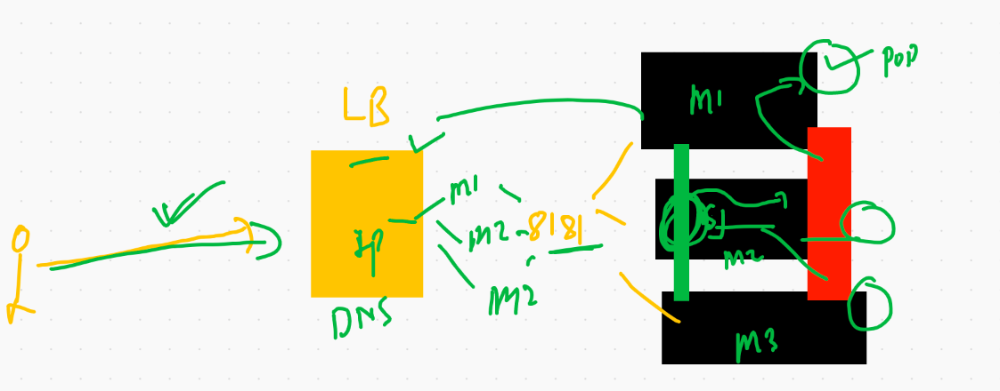
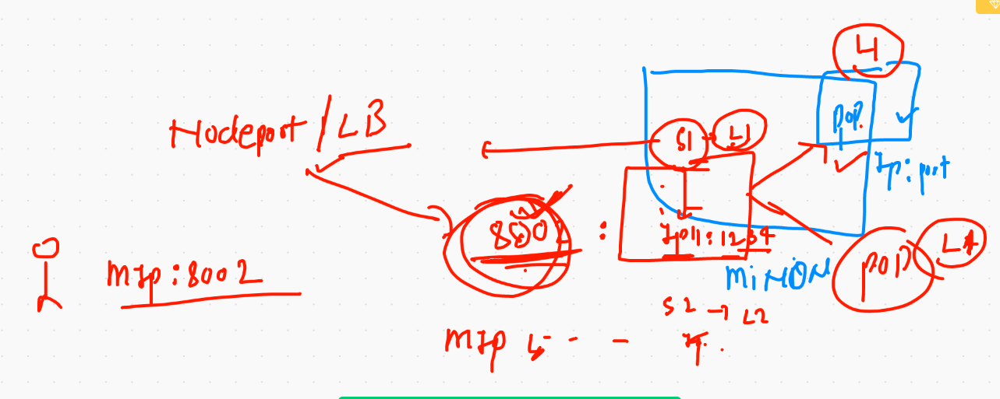
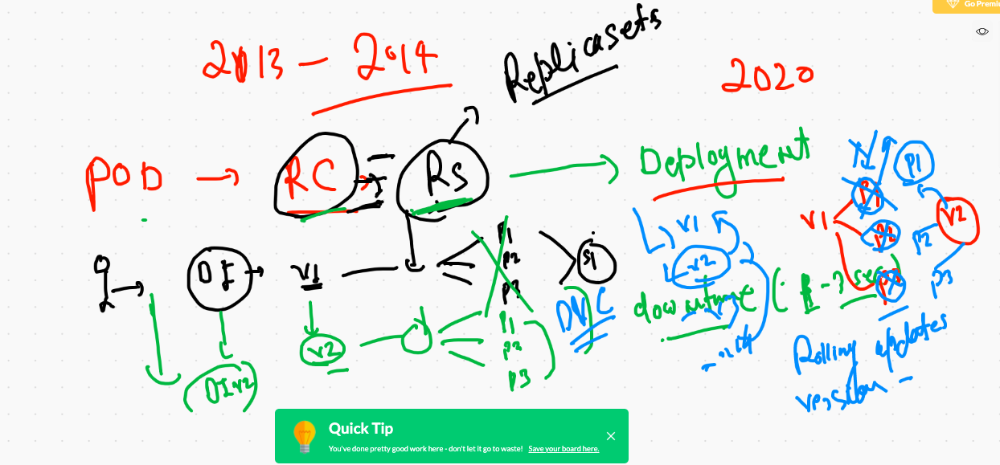

# K8s application deployment platform for containers


## checking and deleting all the pods

```
❯ kubectl get po
NAME          READY   STATUS    RESTARTS   AGE
pod1          1/1     Running   1          16h
ranganath     1/1     Running   1          16h
rk            1/1     Running   1          16h
rohitpod-2    1/1     Running   1          16h
sathishpod1   1/1     Running   1          16h
svpod1        1/1     Running   1          16h
swamypod1     1/1     Running   1          16h
tkbpod        1/1     Running   1          16h
❯ kubectl delete pods --all
pod "pod1" deleted
pod "ranganath" deleted
pod "rk" deleted
pod "rohitpod-2" deleted
pod "sathishpod1" deleted
pod "svpod1" deleted
pod "swamypod1" deleted
pod "tkbpod" deleted


```

## generate yaml or json file 

```
❯ kubectl  run  ashupod2  --image=nginx --port=80  --dry-run=client
pod/ashupod2 created (dry run)
❯ kubectl  run  ashupod2  --image=nginx --port=80  --dry-run=client  -o yaml
apiVersion: v1
kind: Pod
metadata:
  creationTimestamp: null
  labels:
    run: ashupod2
  name: ashupod2
spec:
  containers:
  - image: nginx
    name: ashupod2
    ports:
    - containerPort: 80
    resources: {}
  dnsPolicy: ClusterFirst
  restartPolicy: Always
status: {}


```

## storing yaml / json in a file 

```
kubectl  run  ashupod2  --image=nginx --port=80  --dry-run=client  -o yaml  >ashupod2.yml

```

## recreating pod 

```
❯ kubectl  replace -f ashupod2.yml --force
pod "ashupod2" deleted
pod/ashupod2 replaced

```

## some commands

```
❯ kubectl  get  pods  ashupod2  -o wide
NAME       READY   STATUS    RESTARTS   AGE     IP                NODE            NOMINATED NODE   READINESS GATES
ashupod2   1/1     Running   0          3m45s   192.168.174.206   minion-node-3   <none>           <none>
❯ kubectl  get  pods   -o wide
NAME          READY   STATUS    RESTARTS   AGE     IP                NODE            NOMINATED NODE   READINESS GATES
ashupod2      1/1     Running   0          4m49s   192.168.174.206   minion-node-3   <none>           <none>
ironman       1/1     Running   0          6m47s   192.168.97.76     minion-node-2   <none>           <none>
nav           1/1     Running   0          7m33s   192.168.97.75     minion-node-2   <none>           <none>
poddemo3      1/1     Running   0          7m40s   192.168.138.76    minion-node-1   <none>   

```


## creating service in k8s 


## more service in k8s


## defining label in pod 

```
❯ cat ashupod1.yml
apiVersion: v1
kind: Pod
metadata:
 name: ashupod1 # unique name will be required
 labels:  #  label is the thing to find pod by any other resource in k8s
  x: ashuapp1   # label must contain a key: value pair and it must be unique 
  y: helloashu
spec:
 containers:
 - image: nginx  # image will be pulled from Docker hub 
   name: ashuc1  # name of container under my pod
   ports: # default port of nginx web server 
   - containerPort: 80
   
```


## checking labels of pods 

```
❯ kubectl get po ashupod2   --show-labels
NAME       READY   STATUS    RESTARTS   AGE   LABELS
ashupod2   1/1     Running   0          39m   run=ashupod2


❯ kubectl get po ashupod2   --show-labels -o wide
NAME       READY   STATUS    RESTARTS   AGE   IP                NODE            NOMINATED NODE   READINESS GATES   LABELS
ashupod2   1/1     Running   0          39m   192.168.174.206   minion-node-3   <none>           <none>            run=ashupod2


```

## k8s networking explaining service type 


## one more for service 


## end user to pod 

## few more concepts 


---




---


---




# service creation in k8s

## nodeport service creation 

```
❯ kubectl  create  service nodeport  ashus1  --tcp 1122:80 --dry-run=client -o yaml
apiVersion: v1
kind: Service
metadata:
  creationTimestamp: null
  labels:
    app: ashus1
  name: ashus1
spec:
  ports:
  - name: 1122-80
    port: 1122
    protocol: TCP
    targetPort: 80
  selector:
    app: ashus1
  type: NodePort
status:
  loadBalancer: {}
❯ kubectl  create  service nodeport  ashus1  --tcp 1122:80 --dry-run=client -o yaml  >ashupod2svc.yml

```

## deleting all svc 

```
❯ kubectl delete service --all
service "ashus1" deleted
service "bprvnrj" deleted
service "kubernetes" deleted
service "navnee" deleted
service "rks1" deleted
service "rohits1" deleted
service "sathishser1" deleted
service "service-nodeport-s4nd33p" deleted
service "sv1" deleted


```

## Exposing pod for creating service

```
kubectl  expose  pod  ashupod2  --type NodePort --port 1122 --target-port 80 --name  ashus111 --dry-run=client -o yaml
apiVersion: v1
kind: Service
metadata:
  creationTimestamp: null
  labels:
    run: ashupod2
  name: ashus111
spec:
  ports:
  - port: 1122
    protocol: TCP
    targetPort: 80
  selector:
    run: ashupod2
  type: NodePort
status:
  loadBalancer: {}
  
  ```
  
  ## Demo
  
  ```
  ❯ kubectl  expose  pod  ashupod2  --type NodePort --port 1122 --target-port 80 --name  ashus11
service/ashus11 exposed
❯ 
❯ 
❯ kubectl get svc
NAME         TYPE        CLUSTER-IP      EXTERNAL-IP   PORT(S)          AGE
ashus11      NodePort    10.100.201.63   <none>        1122:31232/TCP   46s
kubernetes   ClusterIP   10.96.0.1       <none>        443/TCP          5m28s
svsvc1       NodePort    10.111.84.218   <none>        1122:30124/TCP   11s

```

## Merging files in yaml

```
❯ kubectl  run ashupod11 --image=nginx --port 80  --dry-run=client -o yaml  >ashupodx.yml
❯ 
❯ 
❯ kubectl create service nodeport ashupodsvc1  --tcp  1122:80  --dry-run=client -o yaml  >>ashupodx.yml

```


## accessing POd using kubectl exec 

```
❯ kubectl  exec  -it  ashupod11  bash
kubectl exec [POD] [COMMAND] is DEPRECATED and will be removed in a future version. Use kubectl exec [POD] -- [COMMAND] instead.
root@ashupod11:/# 
root@ashupod11:/# 
root@ashupod11:/# cat  /etc/os-release 
PRETTY_NAME="Debian GNU/Linux 10 (buster)"
NAME="Debian GNU/Linux"
VERSION_ID="10"
VERSION="10 (buster)"
VERSION_CODENAME=buster
ID=debian
HOME_URL="https://www.debian.org/"
SUPPORT_URL="https://www.debian.org/support"
BUG_REPORT_URL="https://bugs.debian.org/"
root@ashupod11:/# cd  /usr/share/nginx/html/
root@ashupod11:/usr/share/nginx/html# ls
50x.html  index.html
root@ashupod11:/usr/share/nginx/html# echo Hello >index.html 

```
## Deploying flask application

```
1914  kubectl  run  ashupypod  --image=dockerashu/ashuflaskapp:v001 --port 5000 --dry-run=client -o yaml >flask.yml
 1915  kubectl apply -f flask.yml
 1916  kubectl  get  po 
 1917  kubectl expose pod ashupypod  --type NodePort --port 1122 --target-port 5000 
 1918  kubectl  get  svc 

```

# Namespaces in K8s


## default namespace

```
❯ kubectl  get  namespace
NAME              STATUS   AGE
default           Active   21h
kube-node-lease   Active   21h
kube-public       Active   21h
kube-system       Active   21h

```

## creating ns

```
❯ kubectl  create namespace  ashu-space
namespace/ashu-space created
❯ kubectl  get  ns
NAME              STATUS   AGE
ashu-space        Active   4s
default           Active   21h
kube-node-lease   Active   21h
kube-public       Active   21h
kube-system       Active   21h

```

## kube-system 

```
❯ kubectl  get  po  -n  kube-system
NAME                                       READY   STATUS    RESTARTS   AGE
calico-kube-controllers-5dc87d545c-6rsh7   1/1     Running   1          21h
calico-node-4qcnq                          1/1     Running   1          21h
calico-node-5k275                          1/1     Running   1          21h
calico-node-lmmm2                          1/1     Running   1          21h
calico-node-r79rf                          1/1     Running   1          21h
coredns-f9fd979d6-b7f8g                    1/1     Running   1          21h
coredns-f9fd979d6-x9tks                    1/1     Running   1          21h
etcd-master-node                           1/1     Running   1          21h
kube-apiserver-master-node                 1/1     Running   1          21h

```


## Namspaec based pod deployment 

```
❯ cat ashupod2.yml
apiVersion: v1
kind: Pod
metadata:
  namespace: ashu-space 
  creationTimestamp: null
  labels:
    run: ashupod2
  name: ashupod2  # name of the pod 
spec:
  containers:
  - image: nginx
    name: ashupod2
    ports:
    - containerPort: 80
    resources: {}
  dnsPolicy: ClusterFirst
  restartPolicy: Always
status: {}

```

## POD with limitations


# Replication Controller

```
apiVersion: v1
kind: ReplicationController
metadata:
 name: ashu-rc-1
 namespace: ashu-space
 labels:  # label of RC 
  x: helloashu

spec:
 replicas: 1  # no of pods we want
 template:
  metadata:
   labels:  # label of POd 
    x: ashuhello
  spec:
   containers:
   - image: nginx
     name: ashuc1 # optional 
     ports:
     - containerPort: 80
     
```

## deploying RC

```
❯ kubectl apply -f ashurc.yml
replicationcontroller/ashu-rc-1 created
❯ kubectl  get  rc  -n ashu-space
NAME        DESIRED   CURRENT   READY   AGE
ashu-rc-1   1         1         1       9s

░▒▓ ~/Desktop/ashuk8sres ····

```

## Exposing RC to svc

```
❯ kubectl  expose  rc  ashu-rc-1 --type NodePort --port 1122 --target-port 80 --name ashusvc11 -n ashu-space
service/ashusvc11 exposed
❯ kubectl  get  svc  -n ashu-space
NAME        TYPE       CLUSTER-IP     EXTERNAL-IP   PORT(S)          AGE
ashusvc11   NodePort   10.103.25.86   <none>        1122:30643/TCP   16s

```

## scaling rc

```
 kubectl  scale  rc  ashu-rc-1  --replicas=3  -n ashu-space
replicationcontroller/ashu-rc-1 scaled
❯ kubectl get po -n ashu-space -o wide
NAME              READY   STATUS    RESTARTS   AGE     IP                NODE            NOMINATED NODE   READINESS GATES
ashu-rc-1-ktlqh   1/1     Running   0          12s     192.168.97.99     minion-node-2   <none>           <none>
ashu-rc-1-qnzqz   1/1     Running   0          105s    192.168.138.92    minion-node-1   <none>           <none>
ashu-rc-1-qz2mc   1/1     Running   0          3m43s   192.168.174.224   minion-node-3   <none>           <none>

```

## RC edit

```
❯ kubectl  edit rc  ashu-rc-1 -n ashu-space
replicationcontroller/ashu-rc-1 edited
❯ kubectl get po -n ashu-space -o wide
NAME              READY   STATUS    RESTARTS   AGE     IP                NODE            NOMINATED NODE   READINESS GATES
ashu-rc-1-49l9v   1/1     Running   0          4s      192.168.174.233   minion-node-3   <none>           <none>
ashu-rc-1-bb9d4   1/1     Running   0          4s      192.168.97.103    minion-node-2   <none>           <none>
ashu-rc-1-f42bt   1/1     Running   0          4s      192.168.97.104    minion-node-2   <none>           <none>
ashu-rc-1-qnzqz   1/1     Running   0          4m23s   192.168.138.92    minion-node-1   <none>           <none>
ashu-rc-1-qz2mc   1/1     Running   0          6m21s   192.168.174.224   minion-node-3   <none>

```


## Some RC delete 

```
1969  kubectl apply -f ashurc.yml 
 1970  kubectl  get  rc  -n ashu-space 
 1971  kubectl  get  pod  -n ashu-space 
 1972  kubectl  expose  rc  ashu-rc-1 --type NodePort --port 1122 --target-port 80 --name ashusvc11 -n ashu-space 
 1973  kubectl  get  svc  -n ashu-space 
 1974  \thistory
 1975  ls
 1976  cat  ashurc.yml
 1977  ls
 1978  kubectl  get  rc -n ashu-space
 1979  history
 1980  kubectl  get  po  -n ashu-space 
 1981  kubectl  get  po  -n ashu-space  -o wide
 1982  kubectl  delete pod ashu-rc-1-g2wbz  -n ashu-space 
 1983  kubectl  get  po  -n ashu-space  -o wide
 1984  ls
 1985  vim ashurc.yml
 1986  kubectl get rc -n ashu-space
 1987  kubectl get po -n ashu-space
 1988  kubectl apply -f ashurc.yml
 1989  kubectl get po -n ashu-space
 1990  kubectl get po -n ashu-space -o wide
 1991  kubectl  scale  rc  ashu-rc-1  --replica=3  -n ashu-space
 1992  kubectl  scale  rc  ashu-rc-1  --replicas=3  -n ashu-space
 1993  kubectl get po -n ashu-space -o wide
 1994  kubectl  scale  rc  ashu-rc-1  --replicas=2  -n ashu-space
 1995  kubectl get po -n ashu-space -o wide
 1996  kubectl  edit rc  ashu-rc-1 -n ashu-space
 1997  kubectl get po -n ashu-space -o wide
 1998  kubectl  get  svc -n ashu-space
 1999  kubectl get po -n ashu-space -o wide --show-labels
 2000  kubectl get svc -n ashu-space

```

## Deployment 



## creating deployment 

```
kubectl create deployment  ashu-dep1  --image=dockerashu/mozilla:appv1 --dry-run=client -o yaml >mozilladep.yml

```
## OR

```
kubectl create deployment  ashu-dep1  --image=dockerashu/mozilla:appv1 -n ashu-space --dry-run=client -o yaml >mozilladep.yml

```


## deployment with namespace 

```
2029  kubectl  create namespace  test1 --dry-run=client -o yaml  >>test.yml
 2030  echo "---"  >>test.yml
 2031  kubectl create deployment  ashu-dep1  --image=dockerashu/mozilla:appv1 -n test1 --dry-run=client -o yaml >>test.yml
 
 ```
 
 ## Reality of Deployment 
 
 
 
 ## more commands
 
 ```
 ❯ kubectl  apply -f  mozilladep.yml
Warning: kubectl apply should be used on resource created by either kubectl create --save-config or kubectl apply
namespace/ashu-space configured
deployment.apps/ashu-dep1 created
❯ vim mozilladep.yml
❯ kubectl  get deployments -n ashu-space
NAME        READY   UP-TO-DATE   AVAILABLE   AGE
ashu-dep1   1/1     1            1           3m21s
❯ 
❯ kubectl  get deployment  -n ashu-space
NAME        READY   UP-TO-DATE   AVAILABLE   AGE
ashu-dep1   1/1     1            1           3m26s
❯ 
❯ 
❯ kubectl  get deploy  -n ashu-space
NAME        READY   UP-TO-DATE   AVAILABLE   AGE
ashu-dep1   1/1     1            1           3m32s
❯ 
❯ kubectl  get rs  -n ashu-space
NAME                   DESIRED   CURRENT   READY   AGE
ashu-dep1-64cf8f46c4   1         1         1       3m42s
❯ kubectl  get po  -n ashu-space
NAME                         READY   STATUS    RESTARTS   AGE
ashu-dep1-64cf8f46c4-nj62x   1/1     Running   0          3m48s

```

## Expose deploy to create svc

```
❯ kubectl expose deployment ashu-dep1 --type NodePort --port 1122 --target-port 80 -n ashu-space
service/ashu-dep1 exposed
❯ kubectl  get svc  -n ashu-space
NAME        TYPE       CLUSTER-IP      EXTERNAL-IP   PORT(S)          AGE
ashu-dep1   NodePort   10.103.187.75   <none>        1122:31068/TCP   10s


```
## External app load Balancer with dNS 


## updating deployment image

```
2064  kubectl describe  deploy ashu-dep1  -n ashu-space
 2065  kubectl set image deployment ashu-dep1 mozilla=dockerashu/mozilla:appv2  -n ashu-space
 2066  kubectl describe  deploy ashu-dep1  -n ashu-space
 
 ```
 ## history commands of deployment
 
 ```
 2087  kubectl set image deployment ashu-dep1 mozilla=dockerashu/mozilla:appv3  -n ashu-space
 2088  kubectl describe  deploy ashu-dep1  -n ashu-space
 2089  history
 2090  kubectl rollout history deploy ashu-dep1 -n ashu-space 
 2091  kubectl rollout undo  deploy ashu-dep1  --to-revision=1  -n ashu-space 
 2092  kubectl rollout status deploy ashu-dep1 -n ashu-space 
 
 ```
 
 
