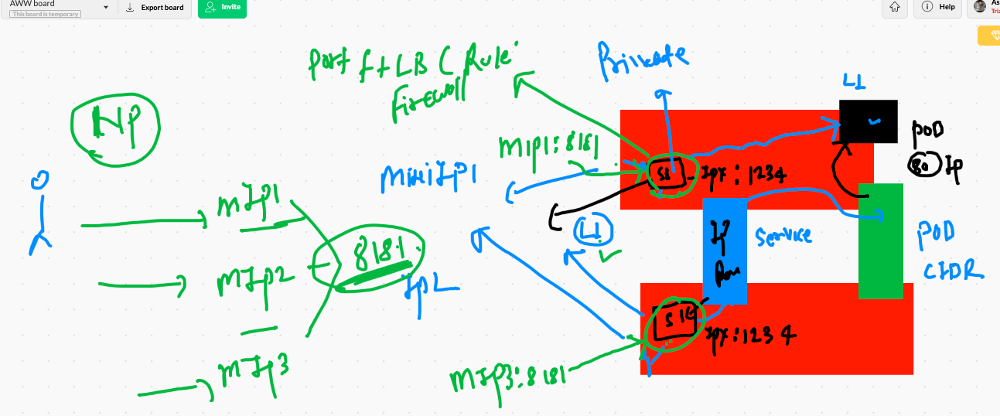

# K8s application deployment platform for containers


## checking and deleting all the pods

```
❯ kubectl get po
NAME          READY   STATUS    RESTARTS   AGE
pod1          1/1     Running   1          16h
ranganath     1/1     Running   1          16h
rk            1/1     Running   1          16h
rohitpod-2    1/1     Running   1          16h
sathishpod1   1/1     Running   1          16h
svpod1        1/1     Running   1          16h
swamypod1     1/1     Running   1          16h
tkbpod        1/1     Running   1          16h
❯ kubectl delete pods --all
pod "pod1" deleted
pod "ranganath" deleted
pod "rk" deleted
pod "rohitpod-2" deleted
pod "sathishpod1" deleted
pod "svpod1" deleted
pod "swamypod1" deleted
pod "tkbpod" deleted


```

## generate yaml or json file 

```
❯ kubectl  run  ashupod2  --image=nginx --port=80  --dry-run=client
pod/ashupod2 created (dry run)
❯ kubectl  run  ashupod2  --image=nginx --port=80  --dry-run=client  -o yaml
apiVersion: v1
kind: Pod
metadata:
  creationTimestamp: null
  labels:
    run: ashupod2
  name: ashupod2
spec:
  containers:
  - image: nginx
    name: ashupod2
    ports:
    - containerPort: 80
    resources: {}
  dnsPolicy: ClusterFirst
  restartPolicy: Always
status: {}


```

## storing yaml / json in a file 

```
kubectl  run  ashupod2  --image=nginx --port=80  --dry-run=client  -o yaml  >ashupod2.yml

```

## recreating pod 

```
❯ kubectl  replace -f ashupod2.yml --force
pod "ashupod2" deleted
pod/ashupod2 replaced

```

## some commands

```
❯ kubectl  get  pods  ashupod2  -o wide
NAME       READY   STATUS    RESTARTS   AGE     IP                NODE            NOMINATED NODE   READINESS GATES
ashupod2   1/1     Running   0          3m45s   192.168.174.206   minion-node-3   <none>           <none>
❯ kubectl  get  pods   -o wide
NAME          READY   STATUS    RESTARTS   AGE     IP                NODE            NOMINATED NODE   READINESS GATES
ashupod2      1/1     Running   0          4m49s   192.168.174.206   minion-node-3   <none>           <none>
ironman       1/1     Running   0          6m47s   192.168.97.76     minion-node-2   <none>           <none>
nav           1/1     Running   0          7m33s   192.168.97.75     minion-node-2   <none>           <none>
poddemo3      1/1     Running   0          7m40s   192.168.138.76    minion-node-1   <none>   

```


## creating service in k8s 


## more service in k8s


## defining label in pod 

```
❯ cat ashupod1.yml
apiVersion: v1
kind: Pod
metadata:
 name: ashupod1 # unique name will be required
 labels:  #  label is the thing to find pod by any other resource in k8s
  x: ashuapp1   # label must contain a key: value pair and it must be unique 
  y: helloashu
spec:
 containers:
 - image: nginx  # image will be pulled from Docker hub 
   name: ashuc1  # name of container under my pod
   ports: # default port of nginx web server 
   - containerPort: 80
   
```


## checking labels of pods 

```
❯ kubectl get po ashupod2   --show-labels
NAME       READY   STATUS    RESTARTS   AGE   LABELS
ashupod2   1/1     Running   0          39m   run=ashupod2


❯ kubectl get po ashupod2   --show-labels -o wide
NAME       READY   STATUS    RESTARTS   AGE   IP                NODE            NOMINATED NODE   READINESS GATES   LABELS
ashupod2   1/1     Running   0          39m   192.168.174.206   minion-node-3   <none>           <none>            run=ashupod2


```

## k8s networking explaining service type 


## one more for service 


## end user to pod 

## few more concepts 




---


---


---


# service creation in k8s

## nodeport service creation 

```
❯ kubectl  create  service nodeport  ashus1  --tcp 1122:80 --dry-run=client -o yaml
apiVersion: v1
kind: Service
metadata:
  creationTimestamp: null
  labels:
    app: ashus1
  name: ashus1
spec:
  ports:
  - name: 1122-80
    port: 1122
    protocol: TCP
    targetPort: 80
  selector:
    app: ashus1
  type: NodePort
status:
  loadBalancer: {}
❯ kubectl  create  service nodeport  ashus1  --tcp 1122:80 --dry-run=client -o yaml  >ashupod2svc.yml

```

## deleting all svc 

```
❯ kubectl delete service --all
service "ashus1" deleted
service "bprvnrj" deleted
service "kubernetes" deleted
service "navnee" deleted
service "rks1" deleted
service "rohits1" deleted
service "sathishser1" deleted
service "service-nodeport-s4nd33p" deleted
service "sv1" deleted


```

## Exposing pod for creating service

```
kubectl  expose  pod  ashupod2  --type NodePort --port 1122 --target-port 80 --name  ashus111 --dry-run=client -o yaml
apiVersion: v1
kind: Service
metadata:
  creationTimestamp: null
  labels:
    run: ashupod2
  name: ashus111
spec:
  ports:
  - port: 1122
    protocol: TCP
    targetPort: 80
  selector:
    run: ashupod2
  type: NodePort
status:
  loadBalancer: {}
  
  ```
  
  ## Demo
  
  ```
  ❯ kubectl  expose  pod  ashupod2  --type NodePort --port 1122 --target-port 80 --name  ashus11
service/ashus11 exposed
❯ 
❯ 
❯ kubectl get svc
NAME         TYPE        CLUSTER-IP      EXTERNAL-IP   PORT(S)          AGE
ashus11      NodePort    10.100.201.63   <none>        1122:31232/TCP   46s
kubernetes   ClusterIP   10.96.0.1       <none>        443/TCP          5m28s
svsvc1       NodePort    10.111.84.218   <none>        1122:30124/TCP   11s

```

## Merging files in yaml

```
❯ kubectl  run ashupod11 --image=nginx --port 80  --dry-run=client -o yaml  >ashupodx.yml
❯ 
❯ 
❯ kubectl create service nodeport ashupodsvc1  --tcp  1122:80  --dry-run=client -o yaml  >>ashupodx.yml

```


## accessing POd using kubectl exec 

```
❯ kubectl  exec  -it  ashupod11  bash
kubectl exec [POD] [COMMAND] is DEPRECATED and will be removed in a future version. Use kubectl exec [POD] -- [COMMAND] instead.
root@ashupod11:/# 
root@ashupod11:/# 
root@ashupod11:/# cat  /etc/os-release 
PRETTY_NAME="Debian GNU/Linux 10 (buster)"
NAME="Debian GNU/Linux"
VERSION_ID="10"
VERSION="10 (buster)"
VERSION_CODENAME=buster
ID=debian
HOME_URL="https://www.debian.org/"
SUPPORT_URL="https://www.debian.org/support"
BUG_REPORT_URL="https://bugs.debian.org/"
root@ashupod11:/# cd  /usr/share/nginx/html/
root@ashupod11:/usr/share/nginx/html# ls
50x.html  index.html
root@ashupod11:/usr/share/nginx/html# echo Hello >index.html 

```
## Deploying flask application

```
1914  kubectl  run  ashupypod  --image=dockerashu/ashuflaskapp:v001 --port 5000 --dry-run=client -o yaml >flask.yml
 1915  kubectl apply -f flask.yml
 1916  kubectl  get  po 
 1917  kubectl expose pod ashupypod  --type NodePort --port 1122 --target-port 5000 
 1918  kubectl  get  svc 

```

