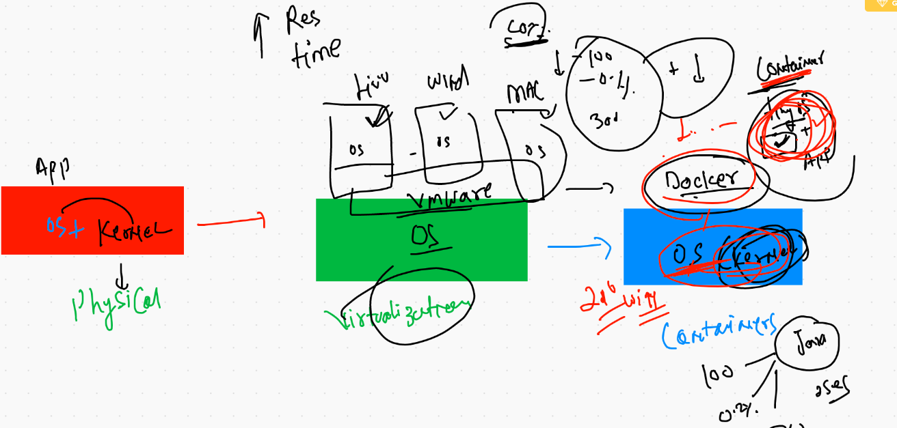
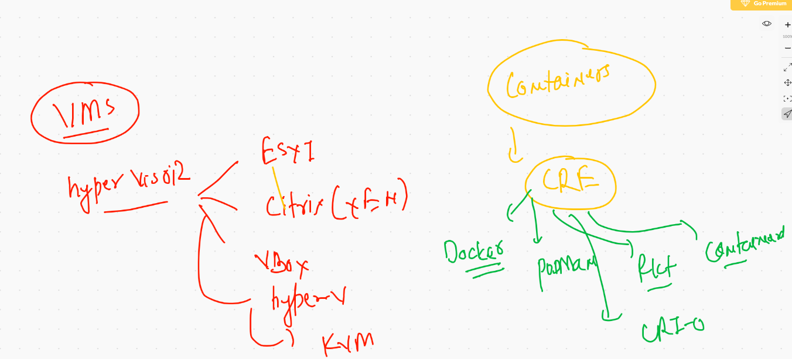
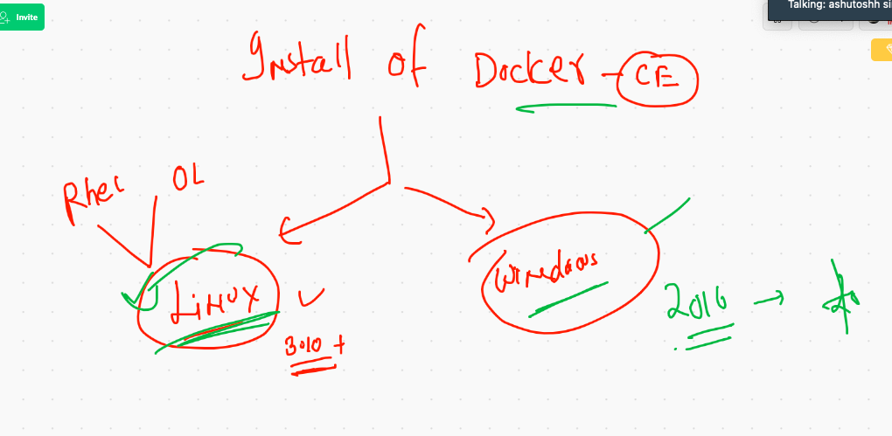

# Containers 

## deployment model of apps


## physical to containers 




## containrers options for Container run time engine (CRE)



## Docker installation 



## Docker desktop on windows 10

[docker desktop] (https://hub.docker.com/editions/community/docker-ce-desktop-windows/)

## Docker desktop on mac os

[docker desktop] ('https://hub.docker.com/editions/community/docker-ce-desktop-mac')


## installation link of docker ce 

[docker docs] ('https://docs.docker.com/engine/install/centos/')

## install docker on aws ec2 instances

```
[root@ip-172-31-75-167 ~]# yum install docker -y
Failed to set locale, defaulting to C
Loaded plugins: extras_suggestions, langpacks, priorities, update-motd
amzn2-core                                                         | 3.7 kB  00:00:00     
Resolving Dependencies
--> Running transaction check
---> Package docker.x86_64 0:19.03.13ce-1.amzn2 will be installed
--> Processing Dependency: runc >= 1.0.0 for package: docker-19.03.13ce-1.amzn2.x86_64
--> Processing Dependency: con

```

## starting docker engine 

```
[root@ip-172-31-75-167 ~]# systemctl start docker 
[root@ip-172-31-75-167 ~]# systemctl enable docker 
Created symlink from /etc/systemd/system/multi-user.target.wants/docker.service to /usr/lib/systemd/system/docker.service.

```


## DOcker client connection 


## basic troubleshooting 

```
ec2-user@ip-172-31-75-167 ~]$ docker  version 
Client:
 Version:           19.03.13-ce
 API version:       1.40
 Go version:        go1.13.15
 Git commit:        4484c46
 Built:             Mon Oct 12 18:51:20 2020
 OS/Arch:           linux/amd64
 Experimental:      false
Got permission denied while trying to connect to the Docker daemon socket at unix:///var/run/docker.sock: Get http://%2Fvar%2Frun%2Fdocker.sock/v1.40/version: dial unix /var/run/docker.sock: connect: permission denied

```

## adding non root users to docker group

```
[root@ip-172-31-75-167 ~]# usermod -a -G docker sandeep 
[root@ip-172-31-75-167 ~]# 
[root@ip-172-31-75-167 ~]# grep docker /etc/group
docker:x:992:sandeep

```

## checking 

```
[ec2-user@ip-172-31-75-167 ~]$ docker version 
Client:
 Version:           19.03.13-ce
 API version:       1.40
 Go version:        go1.13.15
 Git commit:        4484c46
 Built:             Mon Oct 12 18:51:20 2020
 OS/Arch:           linux/amd64
 Experimental:      false

Server:
 Engine:
  Version:          19.03.13-ce
  API version:      1.40 (minimum version 1.12)
  Go version:       go1.13.15
  Git commit:       4484c46
  Built:            Mon Oct 12 18:51:50 2020
  OS/Arch:          linux/amd64
  Experimental:     false
 containerd:
  Version:          1.4.1

```


## Docker image concept


## docker images places to search and download 


## Docker command line client 

```
 14  docker  search  centos 
   15  docker  search  java
   16  docker  images

```

## docker pull images

```
ec2-user@ip-172-31-75-167 ~]$ docker pull  java
Using default tag: latest
latest: Pulling from library/java
5040bd298390: Pull complete 
fce5728aad85: Pull complete 
76610ec20bf5: Pull complete 
60170fec2151: Pull complete 
e98f73de8f0d: Pull complete 
11f7af24ed9c: Pull complete 
49e2d6393f32: Pull complete 
bb9cdec9c7f3: Pull complete 
Digest: sha256:c1ff613e8ba25833d2e1940da0940c3824f03f802c449f3d1815a66b7f8c0e9d
Status: Downloaded newer image for java:latest
docker.io/library/java:latest
[ec2-user@ip-172-31-75-167 ~]$ docker  images
REPOSITORY          TAG                 IMAGE ID            CREATED             SIZE
java                latest              d23bdf5b1b1b        3 years ago         643MB

```

## image id storage in docker host

```
root@ip-172-31-75-167 docker]# cd  /var/lib/docker/
[root@ip-172-31-75-167 docker]# ls
builder  buildkit  containers  image  network  overlay2  plugins  runtimes  swarm  tmp  trust  volumes
[root@ip-172-31-75-167 docker]# cd  image/
[root@ip-172-31-75-167 image]# ls
overlay2
[root@ip-172-31-75-167 image]# cd  overlay2/
[root@ip-172-31-75-167 overlay2]# s
bash: s: command not found
[root@ip-172-31-75-167 overlay2]# ls
distribution  imagedb  layerdb  repositories.json
[root@ip-172-31-75-167 overlay2]# cd imagedb/
[root@ip-172-31-75-167 imagedb]# ls
content  metadata
[root@ip-172-31-75-167 imagedb]# cd  content/
[root@ip-172-31-75-167 content]# ls
sha256
[root@ip-172-31-75-167 content]# cd sha256/
[root@ip-172-31-75-167 sha256]# ls
0d120b6ccaa8c5e149176798b3501d4dd1885f961922497cd0abef155c869566
593eafc929af0a493b1b42fa22b2f204445ebb5d7815006386cd0efc6d225b2c
7535676bcf14d6e467793d6ea0469cb1eab4a8c219d24630f539fadc19492a06
a3fe352c53772546456396ede7a671fea7db15d8524ec91daa8b690adcf58fd1
d23bdf5b1b1b1afce5f1d0fd33e7ed8afbc084b594b9ccf742a5b27080d8a4a8
d6e46aa2470df1d32034c6707c8041158b652f38d2a9ae3d7ad7e7532d22ebe0
dd7265748b5dc3211208fb9aa232cef8d3fefd5d9a2a80d87407b8ea649e571c
[root@ip-172-31-75-167 sha256]# docker images
REPOSITORY          TAG                 IMAGE ID            CREATED             SIZE
mysql               latest              dd7265748b5d        9 days ago          545MB
oraclelinux         7.9                 593eafc929af        11 days ago         256MB
python              latest              a3fe352c5377        11 days ago         886MB
oraclelinux         8                   7535676bcf14     

```

## container parent processs


## first container got created 

```
[ec2-user@ip-172-31-75-167 ~]$ docker  run  alpine:latest   cal  2021   
                              2021                              

      January               February               March        
Su Mo Tu We Th Fr Sa  Su Mo Tu We Th Fr Sa  Su Mo Tu We Th Fr Sa
                1  2      1  2  3  4  5  6      1  2  3  4  5  6
 3  4  5  6  7  8  9   7  8  9 10 11 12 13   7  8  9 10 11 12 13
10 11 12 13 14 15 16  14 15 16 17 18 19 20  14 15 16 17 18 19 20
17 18 19 20 21 22 23  21 22 23 24 25 26 27  21 22 23 24 25 26 27
24 25 26 27 28 29 30  28                    28 29 30 31
31
       April                  May                   June        


```


## checking container status

```
ec2-user@ip-172-31-75-167 ~]$ docker  ps  -a
CONTAINER ID        IMAGE               COMMAND             CREATED              STATUS                          PORTS               NAMES
ff8b4beb2b90        alpine:latest       "cal 2021"          23 seconds ago       Exited (0) 22 seconds ago                           goofy_goldwasser
4ba29e0a60a8        alpine              "cal 2022"          24 seconds ago       Exited (0) 23 seconds ago                           rk_alpine
f0c6e3cb7736        alpine:latest       "date"              32 seconds ago       Exited (0) 32 seconds ago                           admiring_williams


```

## container with ping parent process 

```
[ec2-user@ip-172-31-75-167 ~]$ docker  run  --name  ashuc1  alpine  ping  8.8.8.8
PING 8.8.8.8 (8.8.8.8): 56 data bytes
64 bytes from 8.8.8.8: seq=0 ttl=52 time=1.092 ms
64 bytes from 8.8.8.8: seq=1 ttl=52 time=1.020 ms
64 bytes from 8.8.8.8: seq=2 ttl=52 time=1.006 ms
64 bytes from 8.8.8.8: seq=3 ttl=52 time=1.017 ms

```

## staring a non running container 

```
ec2-user@ip-172-31-75-167 ~]$ docker  start   ashuc1  
ashuc1
[ec2-user@ip-172-31-75-167 ~]$ docker  ps 
CONTAINER ID        IMAGE               COMMAND             CREATED             STATUS              PORTS               NAMES
ec8bc9a10061        alpine              "ping 8.8.8.8"      57 seconds ago      Up 56 seconds                           sathish_ping
feff99d2e16d        alpine              "ping 8.8.8.8"

```

## checking ouptut 

```
 58  docker  logs  ashuc1  
   59  docker  ps
   60  docker  start ashuc1
   61  docker  ps
   62  docker  logs -f  ashuc1  

```

## container in background

```
[ec2-user@ip-172-31-75-167 ~]$ docker run  --name  ashuc1  -d  alpine  ping fb.com 
a9c24d9995d0ec59a1d97d1e069c5bc61b97ed1821a867ff48290a1a622d4b21
[ec2-user@ip-172-31-75-167 ~]$ 
[ec2-user@ip-172-31-75-167 ~]$ docker  ps
CONTAINER ID        IMAGE               COMMAND             CREATED             STATUS              PORTS               NAMES
a9c24d9995d0        alpine              "ping fb.com"       14 seconds ago      Up 13 seconds 

```


## container child process

```
 81  docker run  --name  ashuc1  -d  alpine  ping fb.com 
   82  docker  ps
   83  docker  logs -f  ashuc1 
   84  history 
   85  docker ps
   86  docker  exec  ashuc1  cal 2021
   87  history 
[ec2-user@ip-172-31-75-167 ~]$ docker  exec  ashuc1  ping 8.8.8.8
PING 8.8.8.8 (8.8.8.8): 56 data bytes
64 bytes from 8.8.8.8: seq=0 ttl=52 time=1.111 ms
64 bytes from 8.8.8.8: seq=1 ttl=52 time=1.004 ms
64 bytes from 8.8.8.8: seq=2 ttl=52 time=1.023 ms
^C
[ec2-user@ip-172-31-75-167 ~]$ docker  ps
CONTAINER ID        IMAGE               COMMAND                 CREATED              STATUS              PORTS               NAMES
635672efdc74        alpine              "ping 8.8.8.8"          About a minute ago   Up About a minute                       thisisnotashuc1
18cbd1d0e199        alpine              "ping www.google.com"   About a minute ago   Up 35 seconds                           rk_alpine_1
32c1f41e2966        alpine              "ping 8.8.8.8"          About a minute ago   Up About a minute                       TKB
c75fddde827f        alpine              "ping fb.com"           2 minutes ago        Up 2 minutes                            rohit
c4297228345d        alpine              "ping fb.com"           3 minutes ago        Up 2 minutes                            sathish_ping2
a9c24d9995d0        alpine              "ping fb.com"           4 minutes ago        Up 4 minutes           

```


## useful docker cli tricks

```
[ec2-user@ip-172-31-75-167 ~]$ docker  kill   $(docker ps   -q)
635672efdc74
32c1f41e2966
[ec2-user@ip-172-31-75-167 ~]$ docker  ps 
CONTAINER ID        IMAGE               COMMAND             CREATED             STATUS              PORTS               NAMES
[ec2-user@ip-172-31-75-167 ~]$ 


```


## removing all non running containers

```
[ec2-user@ip-172-31-75-167 ~]$ docker rm  $(docker  ps   -a -q)
635672efdc74
3d1d5a416592
18cbd1d0e199
32c1f41e2966

```

## getting a shell a parent process

```
[ec2-user@ip-172-31-75-167 ~]$ docker  run  --name  ashuc3 -it  oraclelinux:8  bash 
[root@c862f55a5995 /]# uname 
Linux
[root@c862f55a5995 /]# uname  -r
4.14.203-156.332.amzn2.x86_64
[root@c862f55a5995 /]# cat  /etc/os-release 
NAME="Oracle Linux Server"
VERSION="8.3"
ID="ol"
ID_LIKE="fedora"
VARIANT="Server"
VARIANT_ID="server"
VERSION_ID="8.3"
PLATFORM_ID="platform:el8"
PRETTY_NAME="Oracle Linux Server 8.3"
ANSI_COLOR="0;31"
CPE_NAME="cpe:/o:oracle:linux:8:3:server"
HOME_URL="https://linux.oracle.com/"
BUG_REPORT_URL="https://bugzilla.oracle.com/"

ORACLE_BUGZILLA_PRODUCT="Oracle Linux 8"
ORACLE_BUGZILLA_PRODUCT_VERSION=8.3
ORACLE_SUPPORT_PRODUCT="Oracle Linux"
ORACLE_SUPPORT_PRODUCT_VERSION=8.3
[root@c862f55a5995 /]# exit
exit
[ec2-user@ip-172-31-75-167 ~]$ uname -r
4.14.203-156.332.amzn2.x86_64
[ec2-user@ip-172-31-75-167 ~]$ 

```


## shell as child process

```
[ec2-user@ip-172-31-75-167 ~]$ docker  run  --name  ashuc4 -d oraclelinux:8  ping fb.com  
680d71803b7a1e5059a643d0ee9ff3871cadc912258125dced249d57a692a7ef
[ec2-user@ip-172-31-75-167 ~]$ 
[ec2-user@ip-172-31-75-167 ~]$ docker  ps
CONTAINER ID        IMAGE               COMMAND             CREATED             STATUS              PORTS               NAMES
8c44378f8e50        oraclelinux:7.9     "bash"              2 seconds ago       Up 1 second                             thisisnotashuc3
680d71803b7a        oraclelinux:8       "ping fb.com"       3 seconds ago       Up 3 seconds                            ashuc4
[ec2-user@ip-172-31-75-167 ~]$ docker  exec  -it  ashuc4  bash 
[root@680d71803b7a /]# 
[root@680d71803b7a /]# 
[root@680d71803b7a /]# exit
exit

```

# namespace and cgroups


## application deployment in container 


### python based application 

#### python code 

```
[ec2-user@ip-172-31-75-167 python_app]$ cat ashu.py 
import subprocess
import time

while 3 > 2 :
    print("Hello world")
    time.sleep(2)
    t=time.ctime()
    print("____________")
    print("current time is ",t)
    print("_____________________")
    time.sleep(1)
    
    ```
    
    ## image build process
    
    ```
    [ec2-user@ip-172-31-75-167 python_app]$ docker build  -t  ashutoshh:pythonapp1 .
Sending build context to Docker daemon  3.072kB
Step 1/7 : FROM  python
 ---> a3fe352c5377
Step 2/7 : MAINTAINER  ashutoshh@linux.com
 ---> Running in d17c7c79aef0
Removing intermediate container d17c7c79aef0
 ---> f4068fe30d8c
Step 3/7 : RUN  mkdir  /codes
 ---> Running in e7f611060a01
Removing intermediate container e7f611060a01
 ---> a2a77cf9db1a
Step 4/7 : COPY  ashu.py   /codes/ashu.py
 ---> c417fb9db92c
Step 5/7 : WORKDIR  /codes
 ---> Running in 48be48b11e3f
Removing intermediate container 48be48b11e3f
 ---> 731aaafbaa1e
Step 6/7 : RUN  chmod +x ashu.py
 ---> Running in 59182a00ffb9
Removing intermediate container 59182a00ffb9
 ---> f8e61b471ad7
Step 7/7 : CMD  ["python","ashu.py"]
 ---> Running in 180fc73c5cb0
Removing intermediate container 180fc73c5cb0
 ---> 1c439cd85c88
Successfully built 1c439cd85c88
Successfully tagged ashutoshh:pythonapp1

```

